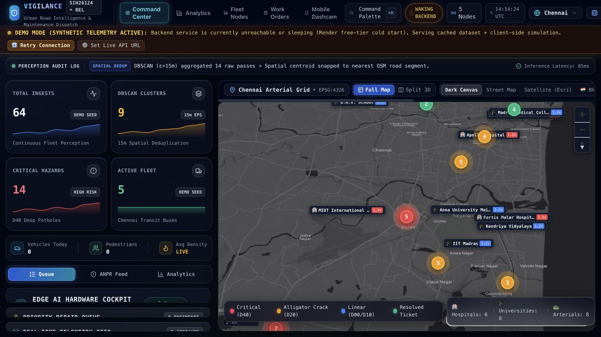
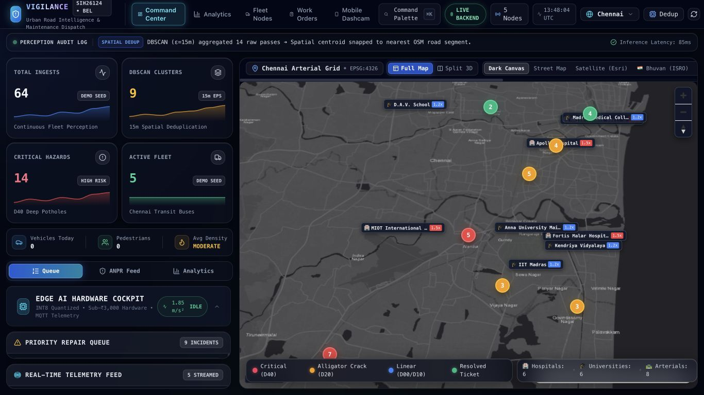
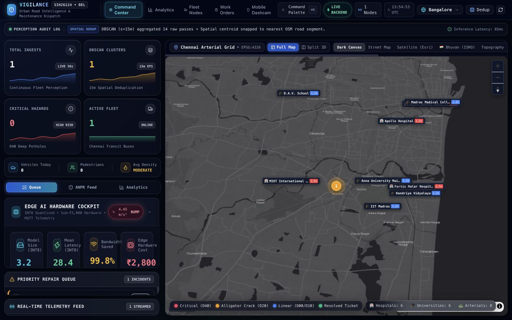
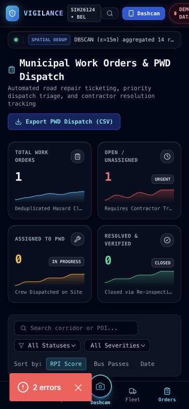
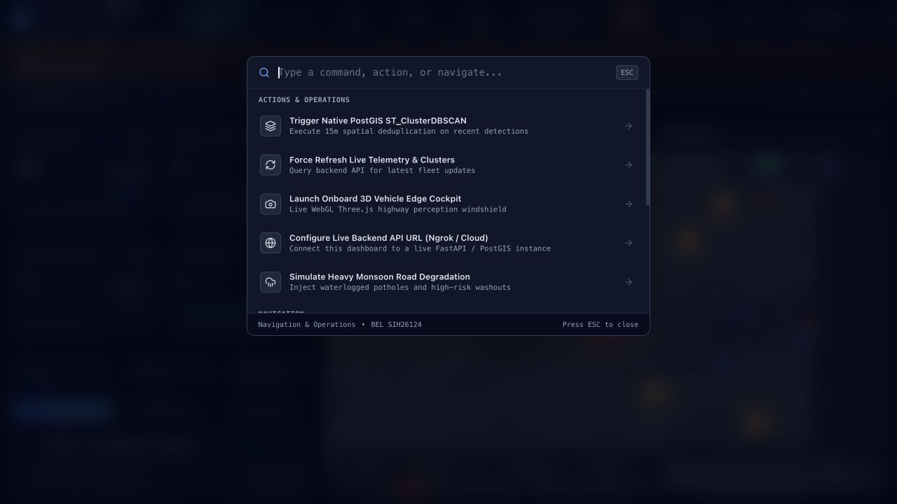

# VIGILANCE — SIH Grand Finale readiness and defense

**Recommendation: stabilize one honest end-to-end workflow, correct the competition claims, and make the repair decision visually obvious before adding features.** The entry has credible engineering ingredients. It currently combines those ingredients with broken integration, unsupported claims and simulation that looks like live operation. A stronger visual theme alone will not make it competitive.

Prepared on **28 September 2026**, against main commit **ae9ec7ba678feb4db366a1058fa55509761fb9e9**. The signed-in GitHub side-browser account was used to check current repository history; its latest commit matches the audited source. The published application was revisited for this brief. Its deployed revision remains **UNVERIFIED**. No repository writes, production mutations or destructive security tests were performed.

This report reuses the same-session build, tests, source review and local reproductions from the [technical audit](Technical_Audit.md), then adds a problem-statement assessment, official 2026 guidance, a fresh judge-facing walkthrough, a new incident-heuristic reproduction, a claims review, a timed demo and 90 jury questions. Existing test results were not represented as a new test run. **No fixes described here have been implemented.**

Evidence labels: **OBSERVED** = browser or executed local behavior; **SOURCE** = inspected implementation; **CLAIM** = repository/deck assertion without sufficient validation; **RECOMMENDATION** = proposed change or expert judgment; **UNVERIFIED** = evidence unavailable. All R/I/E identifiers refer to the supplied technical audit. New evidence identifiers start with S.

## 1. Project understanding

VIGILANCE is intended to use journeys that buses already make as repeated observations of a city. Onboard software should turn camera frames into geotagged events. A central system should combine repeated observations, distinguish one persistent problem from many sightings, and help a transport or municipal operator decide what to inspect, repair or investigate. Citizens benefit indirectly through maintenance and traffic decisions; drivers should not need to operate a complex dashboard while driving.

The decision makers are municipal engineers, transport controllers and authorized incident reviewers. Fleet technicians install and maintain cameras, power, network and credentials. A maintenance contractor is a downstream participant, not yet a verified integration. BEL is the named problem-statement organization, not evidence of a customer contract, endorsement or live command-center connection.

Your strongest current engineering direction is the bridge between **repeated fleet observations and an explainable repair priority**. YOLO, quantization, DBSCAN, mapping and a PWA are established techniques. Their presence is not a novelty claim. The potential contribution is a dependable operational workflow with evidence, uncertainty, duplicate handling and human decisions. That contribution must be demonstrated and compared with alternatives.

### Problem-statement authority and scope

The repository contains the text of **26124, AI-Powered Mobile Urban Intelligence Platform Using Public Transport Fleet**, attributed to BEL. This text is the working requirements source for the assessment below. The official problem-statement portal returned an access error during independent verification; the repository transcription’s current official equivalence remains **UNVERIFIED**. Obtain the portal export from the SPOC before submission. [SIH2026_Official_Problem_Statements.md:2469](https://github.com/SanjeevAryanUni/Vigilance/blob/ae9ec7ba678feb4db366a1058fa55509761fb9e9/docs/SIH2026_Official_Problem_Statements.md#L2469)

There is a metadata conflict: the repository transcription says “Fitness & Sports,” the root deck says “Smart Automation,” and the README/refreshed deck use transportation-oriented themes. Do not choose a theme from intuition. Match the team’s actual portal entry and retain its export. This inconsistency does not change the functional description below.

| PS obligation | Actual implementation and evidence | Status | Jury implication and smallest defensible next step |
|---|---|---|---|
| Onboard and centralized platform | Actual ONNX artifacts, edge modules, FastAPI/SQLAlchemy and Next UI exist; local HTTP persistence works. Stream-to-database integration is incomplete. [detector.py](https://github.com/SanjeevAryanUni/Vigilance/blob/ae9ec7ba678feb4db366a1058fa55509761fb9e9/vigilance-prototype/edge/detector.py) [stream_video.py](https://github.com/SanjeevAryanUni/Vigilance/blob/ae9ec7ba678feb4db366a1058fa55509761fb9e9/vigilance-prototype/edge/stream_video.py) [main.py](https://github.com/SanjeevAryanUni/Vigilance/blob/ae9ec7ba678feb4db366a1058fa55509761fb9e9/vigilance-prototype/backend/main.py) | Partial | Show the exact supported transport and persisted event. Do not narrate an untested full chain. |
| Multiple bus camera streams | One MP4/MJPEG path; dashboard camera panels include simulated rear/depth/IMU output. I13. | Partial | Prove two independent camera sources with synchronized timestamps, or label single-camera prototype and retain the PS gap. |
| Potholes and damaged roads | Four RDD defect classes; shipped road model executes. Prepared pothole-card smoke produced no boxes at the tested thresholds. R10. [rdd2022.yaml](https://github.com/SanjeevAryanUni/Vigilance/blob/ae9ec7ba678feb4db366a1058fa55509761fb9e9/training/data/rdd2022.yaml) | Partial | Collect positive/negative route samples and validate on the actual device. Execution is not field accuracy. |
| Missing dividers | No dedicated model/class or reference-asset comparison identified in the inspected road/traffic paths. | Missing | Requires expected infrastructure inventory plus observation/occlusion reasoning; do not treat no detection as absence. |
| Missing zebra crossings | Four road classes and COCO traffic classes do not implement this deficiency decision. | Missing | Build a narrowly scoped, independently evaluated crossing inventory comparison after core stabilization. |
| Damaged or missing signs | No verified sign-condition/inventory pipeline. | Missing | Separate sign detection, classification, damage assessment and expected-but-missing reasoning. |
| Waterlogging and other hazards | Monsoon simulation/control exists; no verified waterlogging model path. | Missing for real detection | Keep simulation labelled; publish covered classes instead of claiming all urban hazards. |
| Vehicle detection/classification/counting | COCO path exists; Python ONNX branch lacks NMS; simulation fallback exists; capture persistence has auth issues. [traffic_detector.py](https://github.com/SanjeevAryanUni/Vigilance/blob/ae9ec7ba678feb4db366a1058fa55509761fb9e9/vigilance-prototype/edge/traffic_detector.py) I08. | Partial | Correct postprocessing, distinguish frame detections from unique vehicle counts, test authenticated persistence. |
| Density and bottlenecks | Count bins, congestion helpers and charts exist; camera geometry/baseline validation is absent. [congestion.py](https://github.com/SanjeevAryanUni/Vigilance/blob/ae9ec7ba678feb4db366a1058fa55509761fb9e9/vigilance-prototype/backend/congestion.py) [TrafficAnalyticsSection.tsx](https://github.com/SanjeevAryanUni/Vigilance/blob/ae9ec7ba678feb4db366a1058fa55509761fb9e9/vigilance-prototype/dashboard-next/src/components/charts/TrafficAnalyticsSection.tsx) | Partial | Label an observation-based estimate; validate against manually counted clips and independently measured travel times. |
| Vulnerable pedestrians/schoolchildren crossing | Generic person detection exists; no verified crossing trajectory, child-specific safety event or risk assessment. | Partial | Demonstrate a cautious person-near-crossing review flag using annotated scenes; do not claim identification of children. |
| Hit-and-run/rash-driving event detection | Standalone heuristic treats road damage plus speed as hit-and-run; no collision evidence. S03. Browser submits plate alerts. [incident_detector.py:51](https://github.com/SanjeevAryanUni/Vigilance/blob/ae9ec7ba678feb4db366a1058fa55509761fb9e9/vigilance-prototype/edge/incident_detector.py#L51) [page.tsx:438](https://github.com/SanjeevAryanUni/Vigilance/blob/ae9ec7ba678feb4db366a1058fa55509761fb9e9/vigilance-prototype/dashboard-next/src/app/capture/page.tsx#L438) | Incorrect | Remove offense assertions; keep “vehicle observation—review required” until a validated event model exists. |
| Track offending vehicle | No persistent offending-object trajectory/identity linkage found in the inspected paths. | Missing | Add temporal tracking and event-to-track association only with a validated incident definition. |
| Registration with confidence, timestamp, GPS | ANPR structures and incident schema exist; dependency fallback may randomize plates; capture writes fail/misname reporter. I08/I14. | Partial | Fail visibly, fix contract, keep source crop/confidence and abstain on unreadable plates. |
| Secure alerts to central command | Shared/default key, unauthenticated alternative routes and anonymous broker undermine security; WebSocket fails. I05/I06. | Incorrect | Device scopes, operator roles, protected transport and server acknowledgment. |
| Fleet aggregation and GIS | Working local ingestion/map foundation, but cross-city state and clustering identity defects. I02/I03. | Partial | Stable event/defect IDs, city isolation and evidence drill-down. |
| Congestion heat maps | Endpoint/visual layer exists; populated display is not an independently validated congestion measure. | Partial | Show sample count, time window, coverage and uncertainty. |
| Infrastructure-deficiency analysis | Required absence/condition pipelines above are missing. | Missing | Keep an explicit capability ledger; agree breadth priorities with sponsor. |
| Origin–destination traffic patterns | Historical analysis conflicts with latest-position upsert; seed fallback returned 226 trips. R08. Bus trajectories also are not passenger OD. | Incorrect | Preserve trajectories and state exactly whose movement is represented; passenger demand requires another data source. |
| Route-delay estimation | Average-speed formula and configured distances exist; capture omits speed and unknown roads fall back to free flow. [delay_estimator.py](https://github.com/SanjeevAryanUni/Vigilance/blob/ae9ec7ba678feb4db366a1058fa55509761fb9e9/vigilance-prototype/backend/delay_estimator.py) I08. | Partial | Return insufficient-data when speed is absent; compare estimates against completed trips. |
| Actionable maintenance/incident reports | PDF/CSV generation works; population, budget, date, zone and SLA semantics are incorrect. I04. | Incorrect | Validate a scoped report against hand-computed fixtures before showing impact. |
| Edge processing reduces bandwidth | Quantized artifacts exist; claimed saving lacks a consistent event-rate/time basis and thumbnail accounting. P1-31. | Partial | Measure transmitted bytes over a defined route including retries and images. |
| Reliable alerts and operational value | No field acceptance study; malformed/unsupported claims and missing outbox reduce reliability. | Unverified end-to-end reliability | Run a small labelled pilot and disclose failures, missing coverage and false alarms. |

These are **22 analyst-decomposed PS obligations**, separate from the 89 implementation-plan items. No official PS percentage is asserted. The plans emphasize a municipal-repair slice; even perfect plan coverage would not establish coverage of this wider PS.

### Implemented, simulated and future scope

| Category | What belongs here today |
|---|---|
| Implemented and locally exercised | Frontend build; actual road-model execution; authenticated detection HTTP path; SQLite persistence; RPI/distance helpers; clustering on fixtures; basic status update; PDF/CSV generation. Defects in these chains remain documented. |
| Implemented but incompletely integrated/validated | Browser capture, traffic and ANPR, cloud deployment, multiple city configuration, video processing, congestion and delay estimates, PostGIS target behavior. |
| Simulated or seeded | Default five-node fleet, seeded incidents/metrics, rotating “audit” messages, hardware/depth values, fallback detections and chart series. Source-specific labels are required. |
| Future or missing | Robust multi-camera operation, supported infrastructure-deficiency detection, event tracking/attribution, durable offline queue, real contractor dispatch/repair verification, calibrated field evaluation, proven municipal adoption and scale. |

## 2. Four implementation plan audit

| Plan | Requirements | Full | Partial | Missing | Incorrect | Unverified | Strict coverage |
|---|---:|---:|---:|---:|---:|---:|---:|
| Plan 1 | 34 | 22 | 3 | 1 | 6 | 2 | 64.7% |
| Plan 2 | 25 | 15 | 5 | 2 | 2 | 1 | 60.0% |
| Plan 3 | Unknown | — | — | — | — | — | N/A — specification unavailable |
| Plan 4 | 30 | 8 | 10 | 0 | 5 | 7 | 26.7% |

Strict coverage means fully satisfied enumerated items divided by all items; partial, incorrect, missing and unverified receive no full credit. These are not quality scores, SIH marks or a probability of winning. **Plan 3 is unavailable.** Its denominator cannot be invented. Existing Track 3 code was reviewed against the PS, but cannot substitute for the missing plan.

The [complete expanded matrix](SIH_Requirement_Matrix.md) contains all 89 rows with requirement, actual behavior, status, exact source evidence, gap, fix, UI exposure and contribution to the PS. It is also embedded in Appendix A of the HTML report.

Plan 1’s configuration/helpers have substantial literal coverage; report semantics, city context and fleet-history assumptions are weak. Plan 2 literally requests some of the cockpit/simulation aesthetic now hurting clarity. Preserve this distinction: satisfying a design instruction can still produce poor operational UX. Plan 4 includes assets and a runbook, but these do not prove an actual recorded end-to-end system.

Conflicts to resolve explicitly: plan examples inherit global city state; report prose promises zone totals omitted by sample code; latest-position upsert breaks historical OD expectations; Plan 2 prioritizes decorative cockpit telemetry; deck/docs disagree on 3 m/15 m clustering, hardware, latency, database versions and test counts. Resolve the intended behavior and update one authoritative specification; do not optimize the compliance number by copying a flawed example. [PLAN_1_SANJEEV_Core_Backend_Municipal_Reports.md](https://github.com/SanjeevAryanUni/Vigilance/blob/ae9ec7ba678feb4db366a1058fa55509761fb9e9/PLAN_1_SANJEEV_Core_Backend_Municipal_Reports.md) [PLAN_2_TEAMMATE1_UI_UX_Redesign_Cockpit.md](https://github.com/SanjeevAryanUni/Vigilance/blob/ae9ec7ba678feb4db366a1058fa55509761fb9e9/PLAN_2_TEAMMATE1_UI_UX_Redesign_Cockpit.md) [PLAN_4_TEAMMATE3_Demo_Assets_Presentation.md](https://github.com/SanjeevAryanUni/Vigilance/blob/ae9ec7ba678feb4db366a1058fa55509761fb9e9/PLAN_4_TEAMMATE3_Demo_Assets_Presentation.md)

## 3. Current application audit

The five pages were inspected in the prior same-session audit at desktop, laptop, tablet and mobile widths. The fresh public dashboard visit for this brief again showed **WAKING BACKEND**, a synthetic-data banner, seeded totals and a technical API-configuration action. “Retry Connection” exists and was clicked; the immediate observation did not confirm recovery. It would be inaccurate to report a missing retry button or to guarantee that the service will never wake. S01/S02.

| Screen | User’s job | Observed/source-supported experience | Readiness decision |
|---|---|---|---|
| Command Center `/` | Find a credible high-priority issue and act | Five nav entries, health badges, seeded KPIs, hardware cockpit, audit ticker, repair queue, map modes and technical controls compete; laptop queue can collapse to headings. | Primary demo screen after hierarchy/state fixes. |
| Work Orders `/work-orders` | Review, assign and track repair | Status mutation persists locally; ten-column layout, invalid timestamp, demo label despite local data, and inferred contractor/SLA overclaim a workflow. | Keep basic status example; do not claim real dispatch. |
| Capture `/capture` | Acquire a real observation | Model/camera/GPS controls exist; permission/hardware tests unverified; traffic/incident auth failures and fallback GPS compromise truth. | Use only after exact device and transport rehearsal. |
| Analytics `/analytics` | Understand trends and network conditions | Some source-derived charts coexist with placeholder series and problematic OD/delay foundations. | Remove from main narrative until provenance is explicit. |
| Fleet `/fleet` | See available vehicles and coverage | Default fleet mapping excludes unknown vehicles; timestamp mismatch; decorative 3D/health presentation. | Brief diagnostic appendix, not proof of installed fleet. |

A judge should not need to infer which number is live by reconciling a header badge with a seed label and a moving ticker. The application needs one consistent source and health model carried through each response, card, map and export.

## 4. Frontend/UI/UX audit

The issue is more specific than “make it modern.” The application spends too much of the visual budget on explaining machinery, and too little on helping an operator decide what to repair next. Borders, glows, animated sparklines, simulated sensor readouts, technical captions and nested pills receive almost equal prominence to location, priority and action.

### Observed design and usability problems

| Area | Specific evidence | Consequence | Correction |
|---|---|---|---|
| Typography | Most UI uses font-mono, uppercase labels and 9–12 px text; actual font loading differs from token names. | Long municipal/contractor names wrap; small distinctions become tiring. | Body 14–16 px sans, metadata 12 px minimum, monospace only IDs/coordinates; use explicit loaded font variables. |
| Hierarchy | Four large sparkline cards precede queue/actions; every section carries an all-caps header, badge and icon. | Primary work is visually buried. | One page title, concise context, compact key counts, dominant queue/map or table. |
| Spacing/height | Fixed-height dashboard, flex children and overflow-hidden shrink the cockpit and queue. | Content disappears despite space in the map pane. | One predictable scroll owner per pane; minimum practical queue height; collapse optional panels by default. |
| Alignment/grid | Cockpit’s lg four-column grid lives inside an approximately 440 px sidebar. | Card content is cramped even on a wide monitor. | Component/container-based columns; two max in this sidebar. |
| Cards/backgrounds | Glass-panel/card/pill variants, inline gradients, nested translucent surfaces, inset and outer glows. | Too many boundaries and inconsistent perceived depth. | Solid base/surface/elevated layers; one subtle border; shadow only for overlays. |
| Color | Cyan/blue gradients dominate ordinary buttons; red/orange/blue encode severity and defect class interchangeably. | Legend “Critical (D40)” implies class fixes severity; real D40 high exposes the mismatch. | Severity gets one mapping; class gets text/icon separately; green reserved for verified success. |
| Contrast | Muted slate-500, 10 px descriptions on translucent dark cards and dense map overlays are visibly hard to read. | Secondary information may be effectively hidden. | Use proposed high-contrast text tokens; measure actual pairs. No formal contrast certification was performed. |
| Icons/images | Lucide plus emoji hospital/college/construction symbols and decorative hardware/rendering graphics. | Different visual weights; pictures seem to prove hardware readiness when they are illustrative. | One icon set, text labels, explicit illustration/simulation captions; real evidence thumbnails for defects. |
| Buttons | Repeated gradient/glass/pill treatments; icon-only city trigger has no accessible name at mobile size. | Actions are hard to rank and access. | Shared button variants; visible primary action per context; 44 px touch target and accessible labels. |
| Navigation | Desktop header keeps all long nav labels at tablet width; city/refresh/dedup clip; command palette is not a substitute. | Important context/action disappears. | Collapse desktop nav earlier; retain city and connection source; menu secondary actions. |
| Tables | Work-orders has 10 columns with location, POI, phone, timestamp and status at once. | Heavy wrapping desktop; horizontal hunt mobile. | 5 essential columns on desktop; row detail drawer; mobile incident cards. |
| Forms | Search has placeholder but status/severity native selects are not clearly labelled; no coherent field/error primitive. | Screen-reader context and visible form guidance are weak. | Persistent labels, associated errors, controlled pending state and useful empty search results. |
| Modals/overlays | Command/brief/formula interactions are implemented separately; keyboard/focus behavior has no acceptance coverage. | Uniform Escape, focus return and focus trapping cannot be assumed. | One Dialog/Sheet primitive with keyboard acceptance tests. No claim of a specific untested focus-trap failure. |
| Empty state | A healthy empty database still shows nine seed clusters; seeded KPI charts do not disappear. | Empty and successful first run are indistinguishable from activity. | “No detections for Bangalore in this period” with capture/import action; never auto-seed live mode. |
| Loading state | Initial splash is polished, but page counts begin at fake populated values; requests repeat every 5 seconds. | A loading transition looks like live evidence. | Skeletons then real empty/data state; do not reset entire page during background refresh. |
| Error state | City changes locally on failure; capture failures/permission errors go to console; status rollback silent. | Users believe actions succeeded or cannot recover. | Inline error with Retry; retain user input; explicit 401/configuration guidance. |
| Success state | “Transmitted”, “Crew Dispatched”, “Verified”, “Zero Packet Loss” used without corresponding acknowledgments/proof. | Success wording exceeds recorded state. | Distinguish detected/queued/sent/acknowledged and assigned/resolved/verified. |
| Motion | Pulses, sparkline effects, 3D animations, marquee audit log and random gauges compete continuously. | Attention is drawn away from changing actual incidents; reduced-motion support absent. | Animate only meaningful changes; use 150–200 ms transitions; honor prefers-reduced-motion. |

No actual destructive delete workflow was found to exercise. Status changes are reversible but consequential; “resolve” should request reason/evidence rather than an unnecessary confirmation for every harmless selection. No app-wide access-control flow or account-management UI exists.

### Responsive evidence

| View | Observed problem | Evidence |
|---|---|---|
| Desktop 1440×900 | Dense tiny-label visual hierarchy, competing map annotations and 10-column orders table | `screenshots/dashboard-desktop.png`, `analytics-desktop.png`, `work-orders-desktop.png` |
| Laptop 1366×768 | Expanded hardware body clipped; queue/feed effectively compressed to headers; map toolbar requires horizontal traversal | `screenshots/dashboard-laptop-1366.png` |
| Tablet 768×1024 | Header’s full desktop navigation leaves city/connection/actions off-screen; fleet cards consume substantial height; simulation dominates | `screenshots/fleet-tablet-768.png` |
| Mobile 390×844 | Header clipped; map controls/legend collide; queue dominated by KPI cards; orders reach bottom navigation before the data table; capture overlays collide with camera prompt | `screenshots/dashboard-mobile-390.png`, `dashboard-mobile-queue.png`, `orders-mobile-390.png`, `capture-mobile-390.png` |

Local screenshots may show Next development error overlays. Those are identified local hydration errors, not claims that the hosted production app displays the dev overlay. Viewport testing did not simulate real-device CPU, camera permission behavior or mobile-browser chrome.

The frontend is **prototype-like because primary tasks and truthful state are unfinished**, supported by these examples. It is not merely a matter of taste or the choice of dark mode.

### Current, good and exceptional

| Stage | Concrete visual outcome | What it would prove |
|---|---|---|
| Current | Dark control-room aesthetic; numerous glows, animated gauges, small labels and fake operational narration; queue visually subordinate. | Breadth of presentation effort, but weak information hierarchy and provenance. |
| Good | One city and dataset state; three relevant totals; visible issue queue linked to map; one “Review issue” action; readable details, honest errors and useful empty states. | The team understands the operator’s decision and has tested the workflow. |
| Exceptional | Selecting a defect reveals real source frames and distinct sightings; the map and evidence list update together; a duplicate is explained; a reviewer records a decision and sees durable history. | Observations become a trustworthy action. This is memorable because the causal chain is visible. |

“Exceptional” above is a proposed acceptance target, not a current feature claim. Do not replace the entire visual language before the event. Remove the largest distractions, establish readable hierarchy and fix the layout constraints first.

## 5. Clutter and demo-polish audit

| Current element | Problem / owner | Keep, remove or redesign | Exact replacement / reason |
|---|---|---|---|
| “Set Live API URL” | Deployment setup exposed to operator; frontend/configuration | Move to restricted setup | No endpoint entry in the normal operator flow. Validate a single upstream before launch. |
| Ngrok/Cloud command and browser prompt | Native prompt lacks context/validation; arbitrary origin changes only some paths | Remove from demo navigation | Admin connection page with verified environment, validation and safe defaults; no on-stage endpoint editing. |
| “Render free-tier cold start” assertion | UI cannot prove every outage is hosting sleep; deployment/UX | Redesign | “Connecting to the service…” followed by honest unreachable state after bounded retry. |
| Synthetic banner plus LIVE elsewhere | Contradictory provenance; state architecture | Consolidate | Persistent “Sample dataset” or “Live observations” label; service health separately. |
| “Cached dataset + simulation” | Seeded data is not necessarily cached user data | Rename | “Sample data loaded” for fixtures; “Saved observations from [time]” only for actual cache. |
| Retry Connection | Useful and present, but insufficient feedback | Keep/refactor | Disabled/spinning “Retrying…” then recovery or one concise error, retaining last successful timestamp. |
| Rotating Perception Audit Log | Fabricated inference, dispatch and priority statements | Remove | Real activity log from server events with actor, timestamp and source, or no log. |
| Hardware cockpit on default page | Static claims and simulated vibration compete with repair task | Move | Engineering diagnostics appendix with measured/source labels. |
| ₹2,800 / sub-₹3,000 badge | Unsupported complete BOM; credibility risk | Remove until verified | “Prototype device: [actual device]”; separately costed target BOM. |
| 28.4 ms / 99.8% gauges | Unverified paired benchmark and dimensionally incomplete saving | Remove from operator UI | Measured performance panel with hardware, workload, timestamp and method. |
| KPI sparklines | Decorative series imply time trends | Remove if not sourced | Number, time window and honest comparison only when backed by observations. |
| Critical hazards vs clusters | Counts represent different populations without explanation | Redesign | “Open repair issues” and “Raw observations” with definitions; no ambiguous total. |
| Five-node counter | Fixtures can resemble installed fleet | Redesign | “5 sample vehicles” or actual heartbeat count with a freshness threshold. |
| UTC clock | Continuous motion without decision value | Remove from crowded header | Put timezone on observation timestamps; optional clock in diagnostics. |
| SIH/BEL badge everywhere | Competition metadata crowds product | Reduce | Keep in About/presentation title; avoid implying deployment/endorsement. |
| Command Palette with SQL names | Describes implementation instead of outcome | Refactor | Navigation/search only in operator view. Engineering actions require permission. |
| Manual “Dedup” button | User can invoke destructive rebuild and must know implementation | Restrict until repaired | Automatic stable aggregation; protected reprocessing action in diagnostics. |
| Simulate Heavy Monsoon | Can be confused with current hazard data | Isolate | Dedicated Sample Session with distinct dataset identifier and reset. |
| Full Map / Split 3D / 3D Cockpit | Multiple low-value choices obscure repair task | Consolidate | Map and Issues view; retain 3D only in technical appendix if it proves an actual sensor relation. |
| Five map-provider buttons | Choice overload and extra dependency risk | Consolidate | One rehearsed basemap; secondary layer menu. Preserve attribution. |
| Live Cam label with Port 8001 tooltip | Local integration detail leaks into product | Rename | “Camera evidence”; per-source readiness, timestamp and unavailable state. |
| Four camera tabs with simulated rear/depth | Suggests unsupported sensing | Remove unsupported tabs | Only connected sources; explicit replay badge for recorded media. |
| BEL Brief modal | Pitch content interrupts operator work | Move | Presentation slide or About; keep product space for decisions. |
| RPI Formula modal | Useful explainability, poor discoverability from unrelated toolbar | Keep/refactor | “Why this priority?” within issue detail with actual factor inputs. |
| Ten-column work-order table | Horizontal scanning and mobile overflow | Redesign | Five summary columns plus detail panel; mobile cards. |
| “Resolved & Verified” | Status write is not verification evidence | Rename | “Marked resolved” until an evidence-backed verification workflow exists. |
| Contractor names and countdowns | Lookup samples resemble official dispatch | Label/refactor | “Suggested owner—sample” and separately recorded assignment/due time. |
| `Invalid Date` | Frontend/backend contract mismatch | Fix | Nullable typed timestamp; render “Not recorded” until valid data exists. |
| Empty fleet/analytics fallbacks | Fiction fills a real absence | Remove automatic fallback | Purpose-specific empty state and explicit sample-session action. |
| GPS lock at default coordinate | False location certainty | Fix | “Location unavailable” or accuracy/age; no submission as live GPS without a fix. |
| Debug overlay | Observed in local development, not established on production | Fix underlying hydration; use production build | Never classify a local Next overlay as a live deployment fact. |
| Dense footer EPSG/stream jargon | Technical detail occupies narrow display | Move | Diagnostic details on request; normal footer needs source/last successful update. |

### Honest connection and data states

This is a proposed state contract for `useDashboardData`, `api.ts`, `Header` and all pages, not a cosmetic banner patch.

| State | Exact user-facing copy | Data / actions |
|---|---|---|
| Connecting, no successful response | “Connecting to VIGILANCE…” | Neutral skeleton; no invented counts. Allow escape to labelled sample session. |
| Live, empty | “Connected. No observations in this city yet.” | Zero totals; “Start capture” only where the operator has that role. |
| Live, populated | “Live observations · updated [time]” | Server-confirmed data. HTTP health and live-stream status remain distinct. |
| HTTP available, WebSocket failed | “Connected · updates every [actual interval]” | Polling may continue; never falsely claim a connected stream. |
| Outage with previous data | “Connection lost. Showing observations saved at [time].” | Mark stale; retry; disable mutations requiring acknowledgment. |
| Outage without data | “Unable to connect. No observations loaded.” | Retry and explicit “Open sample session”; no silent fixture substitution. |
| Deliberate sample session | “Sample session · synthetic observations” | Isolated dataset; no real incident alerts/dispatch; visibly retain the label in exports. |
| Authentication expired | “Session expired. Sign in to continue.” | Preserve draft where implemented; do not retry indefinitely or expose credentials. |
| Save in progress | “Saving…” | Disable duplicate action, retain current state until acknowledgment. |
| Save failed | “Couldn’t save this change. Try again.” | Roll back optimistic state and retain editable draft; show reference ID, not stack trace. |
| Model unavailable | “Road model unavailable on this device.” | No simulated boxes in real mode; show supported replay option. |
| Location unavailable | “Location unavailable. Enable location or select a clearly labelled test location.” | No GPS-lock badge; do not mix manual coordinates with measured ones. |

Source labels must survive export, refresh, reconnect and navigation. Test the empty healthy API separately from an unavailable API. Both currently lead to misleading experiences in different ways.

## 6. Functionality audit

| Flow | Access → API → database → UI | Errors / edge cases / outcome |
|---|---|---|
| Road detection by HTTP | Correct auth permits POST; valid observation stored; fleet updated; cluster/RPI computed; polling returns it; browser shows real row | **Working local happy path.** Invalid taxonomy accepted; response differs from frontend Detection type; WebSocket broken; full-history dedup unsafe. |
| Capture road inference | User can open capture, choose camera/simulator/manual input; real ONNX files available; road mutation includes auth | Physical camera and browser-model accuracy UNVERIFIED. Simulator media did not play in tested browser state; GPS lock/42 km/h still shown. A manual synthetic detection must not be presented as recognition. |
| Traffic capture | Frontend helper calls /api/traffic; backend and TrafficObservation table exist | Header absent→401; speed/field mismatch; UI does not give useful failed-delivery state. Python traffic ONNX path also lacks road detector’s NMS, risking duplicate anchors/counts. |
| ANPR/incident | Capture/OCR and incident endpoint/table/list exist; lookup route accessible | Header absent→401; reporter field mismatch; Python adapter may simulate without dependencies. No evidence supports automatic hit-and-run/rash-driving inference from these records. |
| Multi-camera/live video | Frontend opens MJPEG view; Python stream annotates one source | No stream→ingestion adapter; additional camera/sensor panels contain fabricated metrics. No genuine concurrent-camera acceptance performed. |
| Dashboard read | Health/stats/detections/clusters are fetched every 5 seconds; map works with seeded and real clusters | Empty successful response does not clear seeds. Fake rotating “audit log” is unrelated to server events. Header source indicators conflict between pages. |
| Work-order status | Browser selection → authenticated status endpoint → persisted cluster status → polling UI | ASSIGNED persisted in R11. No recipient dispatch, assignee, actor, audit history or repair proof. Failed status update rolls back without an explanatory toast. Two rapid requests are not serialized. |
| City switching | Dropdown→POST→global active city→button label | Switch itself succeeds, while map/data stay Chennai. Cross-city report/empty fleet behavior fails. Multi-worker consistency unverified and structurally unsafe. |
| Municipal exports | Local JSON/PDF/CSV work; work-orders also has a separate client-side CSV export | Local PDF generation succeeds, but semantic scope is wrong. Hosted proxy defaults to localhost. Distinguish backend municipal report from client-filtered dispatch CSV. |
| Fleet/OD/delay | API holds latest fleet row; UI merges only the five known fixtures; analytics routes compute or return seed data | Unknown/new vehicle absent from UI; temporal trajectory unavailable through HTTP upsert; chart panels include fixed passenger/delay/hourly data. |
| Offline use | PWA caches frontend assets; BroadcastChannel shares local tab messages | No durable acknowledged detection outbox demonstrated. Service-worker app caching is not telemetry synchronization. Phone and laptop require a real server/broker transport. |
| Government integrations | RC client stub uses configurable HTTP request; MoRTH returns a static dictionary; metadata serves JSON | No live API approval, OAuth/mTLS exchange, AIRAWAT job or official data refresh verified. “Integration_ready” must not mean operationally verified. |

**KEEP — no change required** for the basic authenticated HTTP happy path, the RPI arithmetic helpers, the Haversine helper, existing semantic defect classes, PDF byte-generation library and current MapLibre/Next/FastAPI technology choices. Keep the successful parts while repairing their contracts and context.

**Additional incident finding S03:** calling the standalone `IncidentDetector.analyze` with one high-confidence pothole, a speed value of 55 km/h, zero pedestrians and a synthetic first plate returns a critical `hit_and_run` event. No collision, fleeing trajectory or link between that plate and the speed is supplied. The unit behavior is reproduced in [incident-heuristic.json](evidence/incident-heuristic.json). Integration of this helper into the running service is **UNVERIFIED**; the inspected browser path submits `LICENSE_PLATE_ALERT`, not a validated offense. [incident_detector.py:25](https://github.com/SanjeevAryanUni/Vigilance/blob/ae9ec7ba678feb4db366a1058fa55509761fb9e9/vigilance-prototype/edge/incident_detector.py#L25) [incident_detector.py:51](https://github.com/SanjeevAryanUni/Vigilance/blob/ae9ec7ba678feb4db366a1058fa55509761fb9e9/vigilance-prototype/edge/incident_detector.py#L51) [page.tsx:438](https://github.com/SanjeevAryanUni/Vigilance/blob/ae9ec7ba678feb4db366a1058fa55509761fb9e9/vigilance-prototype/dashboard-next/src/app/capture/page.tsx#L438)

This is a **critical semantic defect for the incident claim**. Do not “fix” it by adjusting a speed threshold. Remove offense attribution from the current demo; define a reviewable event taxonomy, calibrated tracking/evidence rules and human confirmation before making an allegation. A plate reading alone is not an offense.

The relevant acceptance chain for each capability is: actual input → model/version → source-labelled event → authorized API → durable DB record → server acknowledgment → display → operator feedback. A replay may prove software processing; a seeded response may prove UI; neither proves installed fleet operation.

## 7. Backend audit

The FastAPI core is repairable and should remain. Its problems are ownership and contracts: duplicate Next API behavior, synchronous full-history clustering plus queued repetition, process-global city, undefined WebSocket key, inconsistent writers and broad fallback behavior. A JSON response does not prove correct reporting semantics. I02–I09/I19.

Use one authoritative ingestion service, shared validation for HTTP/MQTT, explicit city/device context and typed response models. Keep inference availability separate from API/DB readiness. Authentication failures must return a useful typed error to capture; catching and discarding them cannot count as graceful degradation. External government adapters should return “not configured” or a sourced response, not a convincing unlabelled stub. [main.py](https://github.com/SanjeevAryanUni/Vigilance/blob/ae9ec7ba678feb4db366a1058fa55509761fb9e9/vigilance-prototype/backend/main.py) [serverStore.ts](https://github.com/SanjeevAryanUni/Vigilance/blob/ae9ec7ba678feb4db366a1058fa55509761fb9e9/vigilance-prototype/dashboard-next/src/lib/serverStore.ts) [mqtt_listener.py](https://github.com/SanjeevAryanUni/Vigilance/blob/ae9ec7ba678feb4db366a1058fa55509761fb9e9/vigilance-prototype/backend/mqtt_listener.py) [api_setu_client.py](https://github.com/SanjeevAryanUni/Vigilance/blob/ae9ec7ba678feb4db366a1058fa55509761fb9e9/vigilance-prototype/backend/api_setu_client.py) [data_gov_client.py](https://github.com/SanjeevAryanUni/Vigilance/blob/ae9ec7ba678feb4db366a1058fa55509761fb9e9/vigilance-prototype/backend/data_gov_client.py)

For finale readiness, prioritize the exact supported request path rather than adding another transport. Verify valid and invalid credentials, duplicate retries, malformed payloads, DB unavailability, missing model and timeout behavior. The existing rate limiter is useful but does not replace authorization, input bounds or a durable job queue.

## 8. Database audit

| Data concern | Current evidence | Required change / acceptance |
|---|---|---|
| Defect identity | Clusters deleted/recreated; status copied from first previous cluster within 25 m. R09. | Stable defect identity; distinct issues 20 m apart retain independent state after repeat ingestion. |
| Observation relationship | No enforced observation→cluster relationship supporting durable history. | Explicit link/history model and migrations; preserve evidence when recomputing clusters. |
| City ownership | Data lacks complete city scoping; process-global selection drives reports. | City identifier and request-scoped queries; two clients cannot change each other’s context. |
| Fleet uniqueness/history | HTTP latest-row upsert, MQTT appends, no unique key; OD expects history. | Unique current position plus retained, bounded trajectory table. |
| Retry identity | No end-to-end event UUID guarantee. | Device/event unique constraint, idempotent acknowledgment; reconnect creates no duplicates. |
| Assignment and resolution | Status alone cannot explain who assigned, due date, verified repair or reopen. | Actor/time/history, separate assignment and resolution evidence; append-only audit events. |
| Zones/road inventory | Names and waypoint samples, no complete ward/asset geometry. | Versioned geometry/ownership source; unknown zones remain unknown. |
| Monetary summaries | Raw detections are treated as repair scopes; fixed area/rates. | Distinct repair population, explicit assumptions, rate version and supervisor review. |
| Migrations | Startup/create-all/add-column behavior is not a reproducible schema history. | Small versioned migration baseline and rollback/backup test. |
| PostgreSQL vs SQLite | Local tests exercise SQLite; PostGIS behavior/hardware deployment not fully verified. | Re-run spatial and transaction fixtures on intended PostgreSQL/PostGIS before asserting equivalence. |
| Volume/retention | Full-history scans and unbounded observation growth. | Index measured hot queries; retention by data purpose; bound images/trajectory storage. |

Do not put a new distributed database in the finale critical path. Repair data semantics and concurrency before optimizing storage technology. Evidence: [models.py](https://github.com/SanjeevAryanUni/Vigilance/blob/ae9ec7ba678feb4db366a1058fa55509761fb9e9/vigilance-prototype/backend/models.py) [database.py](https://github.com/SanjeevAryanUni/Vigilance/blob/ae9ec7ba678feb4db366a1058fa55509761fb9e9/vigilance-prototype/backend/database.py) [dbscan_dedup.py](https://github.com/SanjeevAryanUni/Vigilance/blob/ae9ec7ba678feb4db366a1058fa55509761fb9e9/vigilance-prototype/backend/dbscan_dedup.py) [od_analysis.py](https://github.com/SanjeevAryanUni/Vigilance/blob/ae9ec7ba678feb4db366a1058fa55509761fb9e9/vigilance-prototype/backend/od_analysis.py) and the local reproduction ledger.

## 9. Security audit

**First action: rotate the exposed database credential.** It is committed in launch scripts. Its validity was not tested and its value is not reproduced. Removal from a current file is not revocation. Review service access and history exposure with the credential owner. [start_full_demo.sh:14](https://github.com/SanjeevAryanUni/Vigilance/blob/ae9ec7ba678feb4db366a1058fa55509761fb9e9/start_full_demo.sh#L14) [start_full_demo.bat:14](https://github.com/SanjeevAryanUni/Vigilance/blob/ae9ec7ba678feb4db366a1058fa55509761fb9e9/start_full_demo.bat#L14)

Other release blockers: public/default browser key, unauthenticated Next mutation paths, anonymous MQTT, unprotected incident/RC reads and inconsistent API auth. Use server-side operator sessions and scoped device credentials; authorize city and operation; restrict broker/database/Redis network exposure. Authentication design must cover every writer, not just the Python route. I05/I16. Keep secrets out of browser bundles and logs.

The configurable browser API URL can route public-client requests to different origins; it belongs in controlled setup with validation, not an operator command. A PWA/localStorage setting is not secure credential storage. A genuine offline queue needs data minimization and a retention policy, not just retry logic.

Input bounds, upload/image budgets, safe CSV cells and image/plate access deserve explicit tests. The existing SQLAlchemy use and HTML escaping are positive foundations; no SQL injection or XSS exploit was demonstrated. CSRF exposure depends on the final cookie/session design and remains a design/test item, not a confirmed exploit. CORS is not authorization. The audited CORS rule was not a universal `*` rule.

The saved npm advisory result has seven package entries, including one critical and two high. Advisory existence is confirmed; exploitability of every advisory in this deployment is not. Upgrade through a supported patched path with route/build/PWA regression checks. See the original audit’s linked vendor advisories and saved `npm-audit.json`. Do not use “government-grade,” “mTLS,” “immutable” or “secure integration” in the pitch unless its configuration and behavior can be shown.

## 10. Performance audit

Measured in the prior audit: production frontend build succeeds; first-load JavaScript is approximately 187 kB for dashboard, 290 kB analytics, 116 kB capture, 179 kB fleet and 175 kB orders. These are build outputs, not measured page-load times. Actual field FPS, mobile thermals, battery, p95 API latency and target fleet capacity remain **UNVERIFIED**.

Highest-value improvements are removing redundant full-history clustering, bounding queries, isolating rendering from high-frequency telemetry, consolidating duplicate polling, lazy-loading optional 3D/chart views and avoiding frequent model initialization. Keep the actual map library and useful components. Do not replace the framework to chase bundle size before fixing the broken workflow. [tasks.py](https://github.com/SanjeevAryanUni/Vigilance/blob/ae9ec7ba678feb4db366a1058fa55509761fb9e9/vigilance-prototype/backend/tasks.py) [dbscan_dedup.py](https://github.com/SanjeevAryanUni/Vigilance/blob/ae9ec7ba678feb4db366a1058fa55509761fb9e9/vigilance-prototype/backend/dbscan_dedup.py) [useDashboardData.ts](https://github.com/SanjeevAryanUni/Vigilance/blob/ae9ec7ba678feb4db366a1058fa55509761fb9e9/vigilance-prototype/dashboard-next/src/hooks/useDashboardData.ts) [package.json](https://github.com/SanjeevAryanUni/Vigilance/blob/ae9ec7ba678feb4db366a1058fa55509761fb9e9/vigilance-prototype/dashboard-next/package.json)

A count of detected boxes is not a calibrated traffic flow rate. A 200-byte message is not a bandwidth rate. Report bytes per route-hour, end-to-end event latency, unique defect precision/recall, device power/thermal behavior and operator review time. Measure image upload/retries/headers in the same experiment.

For sizing, let N be devices and r be accepted events/device/second: ingress is N×r events/second. Daily event bytes are N×r×86,400×mean serialized bytes, plus image bytes, broker/protocol overhead and retries. This is a model for measurement, not a capacity claim.

| Proposed adoption level | What must be demonstrated before claiming support |
|---|---|
| 10 operators/devices | Correct concurrent status/city behavior, restart persistence, one machine’s measured load and auth. Current multi-user defects still matter here. |
| 1,000 operators or devices | Separate these populations; emulate actual ingress rate, fan-out/subscriptions, images and history; report p95 latency, queue depth and error/loss rate. |
| 100,000 operators or devices | Capacity/cost study using realistic active fraction and device rates; regional isolation, backpressure, deployment operations and recovery. No current capacity evidence. |
| Multiple institutions/states/countries | Tenant/city permissions, road/asset ownership, locale/timezone, model domain shifts, retention and operational ownership. A city dropdown proves none of these. |

## 11. GitHub, code quality and competition materials

The current source head matches the prior audit. Main is unprotected; one PR exists, but no claim is made that its work is merged. Feature-branch age is evidence of divergence, not proof that a teammate abandoned work. Root/backend requirements differ; latest inspected CI fails importing `slowapi`; full local suite was **61 passed, 1 failed, 121 warnings**. Frontend build passed. The audit environment explicitly added the needed backend/dev dependencies; it does not prove the README’s clean-clone path works.

Large files (`main.py` ~933 lines, capture ~1,006, dashboard ~762), repeated UI patterns, broad catches and 402 Ruff findings raise maintenance cost. Of these, 3 F821 findings deserve immediate review; 64 unused-import findings are lower priority. Do not spend finale preparation formatting every file before resolving event correctness. [ci.yml](https://github.com/SanjeevAryanUni/Vigilance/blob/ae9ec7ba678feb4db366a1058fa55509761fb9e9/.github/workflows/ci.yml) [requirements.txt](https://github.com/SanjeevAryanUni/Vigilance/blob/ae9ec7ba678feb4db366a1058fa55509761fb9e9/requirements.txt) [requirements.txt](https://github.com/SanjeevAryanUni/Vigilance/blob/ae9ec7ba678feb4db366a1058fa55509761fb9e9/vigilance-prototype/backend/requirements.txt)

### Deck and script truth review

Both decks were inspected through OOXML text/media inventories. Full slide-by-slide visual rendering remains **UNVERIFIED**. The root deck has nine slides and 87 embedded media items; the README-designated canonical deck has seven slides and six media items. Those counts do not by themselves prove clutter or quality. Conflicting text is enough to reject both as final factual authorities without edits.

| Claim / material | Evidence and problem | Replacement before presenting |
|---|---|---|
| 3 m DBSCAN in refreshed deck vs 15 m code/root deck | Conflicting thresholds; status transfer uses another 25 m proximity rule. | Explain actual clustering and identity separately; use measured uncertainty and regression evidence. |
| 30 FPS on ARM/Pi, 28 ms on Pi Zero | No target-device benchmark establishing these claims; benchmark distinguishes Apple Silicon and projected Pi. | Device-specific measured latency/FPS and exact hardware; otherwise “target, not measured.” |
| Sub-₹3,000 complete node / zero infrastructure | BOMs conflict and omit mounting, power, storage/network and operations. | Costed prototype BOM and recurring cost; say “reuses routes,” not “zero infrastructure.” |
| “63 lakh km of transit routes” / 24×7 coverage | No route coverage evidence; road-network extent is not transit coverage or time coverage. | Demonstrate actual sampled route geometry and revisit interval; remove unverified national number. |
| 65% crash reduction / 40% carbon reduction / 10× saving | Not measured for VIGILANCE; literature or targets cannot establish causal product effect. | Pilot hypotheses and measurement protocol; no achieved-outcome wording. |
| 9,438 fatalities / 20% road-distress fatalities / ₹2.5 lakh crore / 50,000 grievances | Existing deck/script statistics lack a verified precise supporting source in this audit. | Omit from spoken hook until primary source, year, scope and denominator are checked. |
| “Zero objective/scientific prioritization” | Sweeping claim about authorities; no domain interviews or procurement study. | “We aim to give the operator a consistent, reviewable evidence queue.” |
| 99.8% bandwidth savings, MQTT v5 | Rate basis missing; client library version confused with protocol. | Measured route-hour bytes with protocol configuration and image traffic included. |
| Immutable before/after proof and contractor verification | Status write is not immutable audit history or physical repair verification. | “Basic repair-status tracking; verification workflow planned.” |
| Multi-camera / depth / IMU | Simulated panels, single stream path; no device proof. | Capability ledger with actual sources; remove fake measurements. |
| AI Setu OAuth/mTLS/AIRAWAT/etc. | Adapters, links or intended architecture do not establish live authorized integration. | Show configured verified integration or explicitly say “planned”; omit provider logo walls. |
| Mapbox/Leaflet and database version claims | Current map implementation is MapLibre; Compose and deck versions differ. | Generated environment/model manifest, not hand-maintained stack lists. |
| 37/46/48 tests, 100% passing | Scope/time/result differ from current audited full suite and CI. | One timestamped command/result with exclusions and failure disclosure. |
| Phone at `localhost`, same Wi-Fi | Each device’s localhost differs; backend binding and secure camera context need correct setup. | Rehearsed reachable HTTPS origin/trusted setup on the real phone; production build and explicit local rehearsal profile. |
| Printed pothole card guarantees detection | Direct model smoke did not detect the provided card. | Validate actual positive and negative samples on the presentation device; do not lower threshold simply to force a box. |
| Failsafe MP4 | Programmatically drawn 720p animation, not an actual system recording. | Record a real successful session with build/source/date caption; keep current animation only as a conceptual explainer. |

Retain one deck as canonical, archive alternatives, remove personal contact/registration details from judge-facing content unless the required submission template asks for them, and keep technical evidence in appendix. Do not remove required SIH template fields based on design preference. The current finale slide format still needs organizer confirmation.

## 12. Architecture audit

Current flow: browser/edge/simulators → multiple HTTP/MQTT/Next paths → Python or process-global Next data → clustering/RPI → dashboard/reports. The same visual output can represent different persistence and provenance paths. That is the principal architecture weakness.

Recommended incremental flow: capture adapters → one authorized ingestion contract → immutable observations → stable defect aggregation → scoped query/report API → operator review/status history. WebSocket can notify clients of durable events; polling is a valid fallback if labelled. Optional broker/worker responsibilities should be clear and tested. Keep frontend and backend as separate deployable components without adding microservices merely to look sophisticated.

| Keep | Refactor | Add only where justified |
|---|---|---|
| Next/React/Tailwind; FastAPI/SQLAlchemy; MapLibre; useful RPI/Haversine helpers; actual model artifacts; existing useful tests | API-origin configuration; duplicate stores; city scope; event contracts; clustering ownership; page composition; simulation separation | Event IDs, source metadata, observation/evidence linkage, migrations, persistent outbox, operator/device authorization, targeted browser/integration tests |

**KEEP — no change required** for the choice of this stack. Choose one supported demo path and verify it through restart. Do not introduce Kubernetes, blockchain, a chatbot or a new mobile rewrite as a finale credibility exercise.

## 13. SIH criteria analysis

**OFFICIAL SIH CRITERIA:** the [SIH 2026 Guidelines, PDF page 20 / printed page 13](https://sih.gov.in/letters/2026/SIH%202026%20Guidelines.pdf#page=20) list novelty, complexity, clarity/details, feasibility, practicability, sustainability, scale of impact, user experience and future progression under idea selection. That document proposes a December 2026 finale. It does not establish numerical weights or an allotted pitch duration in the inspected text. A finale-specific scoring sheet/time slot remains **UNVERIFIED**; obtain it from the organizer/SPOC. Do not treat the idea-selection paragraph as a complete round-by-round finale rubric.

**EXPERT RECOMMENDATION:** the meanings, evidence tests and actions in the following table are my assessment framework applied to your entry, not official SIH marks. “Completeness” is used as a practical test of clarity and PS coverage, not a newly invented official weighted criterion. The five-minute runbook is a rehearsal format pending your actual slot.

| Dimension | Expert interpretation | Current evidence | Weak/missing evidence | Strengthening action and evidence to collect |
|---|---|---|---|---|
| Novelty | A useful difference compared with existing approaches, not a technology list | Multi-pass aggregation and priority workflow; actual model artifacts | No comparative pilot or new algorithm evidence; clustering itself is established | Compare raw detection queue with stable fused issue queue on the same route. Count duplicate work removed and incorrect merges; show one causal example. |
| Complexity | Engineering difficulty handled reliably | CV artifacts, geospatial computation, two execution environments, multiple transports | Integration boundaries fail; breadth can conceal shallow implementations | Demonstrate a real event surviving capture, authenticated ingestion, persistence, aggregation and review; show a failure/recovery trace. |
| Clarity and details | A judge can understand problem, inputs, output and evidence | Recognizable map, RPI formula, source repository | Dense UI, conflicting claims/decks, missing Plan 3 and PS gaps | One capability ledger and canonical deck; explain “observation” vs “repair issue”; show source frame beside action. |
| Feasibility | Can the chosen hardware/software perform the task under defined conditions? | Local build and inference; useful benchmark document | Actual bus/phone hardware, thermal stability, night/rain and camera placement unverified | Record hardware/model hash, workload, p50/p95, drop rate and power/temperature during a realistic continuous run. |
| Practicability | Can staff use and maintain it in an actual workflow? | Work-order UI and scoped-report intention | No operator validation, real contractor handoff, installation approval or coverage study | Observe a municipal/transport workflow; test triage with representative operators; document installation and responsibility handoffs. |
| Sustainability | Ongoing cost, maintenance and model/data governance remain workable | Open components and reuse of existing journeys | Unsupported BOM, no replacement/cleaning/calibration/connectivity budget | Cost a complete node and route-month; identify support owner, retraining triggers, data retention and repair/replacement schedule. |
| Scale of impact | Demonstrable benefit multiplied by reachable coverage | Useful target decision: prioritized maintenance | No measured time/cost/safety outcome; bus routes leave spatial/time gaps | Measure reviewed unique issues, review minutes, route-km actually seen and time from accepted observation to action; disclose denominator and baseline. |
| User experience | Operators can understand and complete tasks with appropriate feedback | Common navigation, filters, map and status control | Clipped queue/nav, dense table, invalid date, uncertain live/demo state | Test key tasks at four widths, keyboard/focus, screen reader labels and projector readability; record completion/error rates and user quotes with consent. |
| Future progression | A credible next step with owners, dependencies and acceptance | Plausible pilot→more routes→broader sensing sequence | National/government integration claims outrun evidence | Stage gates for data integrity, device pilot, operational acceptance and only then wider deployment; secure a real pilot conversation. |

### Novelty and alternatives: the honest competitive position

NHAI announced AI dashcam monitoring over approximately 40,000 km of national highways in March 2026, including route-patrol surveys, defect analysis and comparison of road condition over time. This establishes relevant prior art and institutional interest; it does not validate VIGILANCE’s cost, accuracy, integration or deployment. Do not claim that vehicle-mounted AI road inspection itself is unprecedented. [Official PIB announcement](https://www.pib.gov.in/PressReleasePage.aspx?PRID=2243028&lang=1&reg=1).

The RDD2022 authors describe a multinational annotated dataset with four road-damage categories and explicitly discuss automated road monitoring. The dataset and standard object-detection tooling are foundations to credit, not original inventions by the team. Dataset-wide statistics also do not establish the composition or performance of your exported checkpoint. [RDD2022 paper](https://arxiv.org/abs/2209.08538).

| Alternative | Fair comparison to test | Possible VIGILANCE distinction | Evidence still required |
|---|---|---|---|
| Manual inspection/citizen complaint workflow | Human contextual judgment and existing accountability versus revisit latency and duplicate reports | Repeat observations from normal fleet journeys plus prioritized review | Baseline observation-to-review time and false-report burden from a real workflow; avoid blanket claims of “no scientific method.” |
| Vehicle-mounted AI road surveys | Similar sensing principle already exists | Urban public-transit revisit patterns, low-cost deployment and integrated human review | Matched route/device benchmark and full operational cost; claim a target niche, not unique global invention. |
| Fixed-camera analytics | Stable calibrated view but spatially fixed | Mobile coverage can observe more locations along actual routes | Coverage/revisit map and moving-camera failure analysis; buses are not everywhere. |
| Generic detection-plus-map demo | Boxes and map pins are easy to imitate | Trustworthy grouping with stable identity, evidence provenance, review and recovery | Same-scene duplicate/counterexample demonstration, audit history and measurement. |

No competing SIH team’s performance was verified. The comparative judgments above are hypotheses to test, not a ranking of competitors or a prediction of winning.

## 14. Jury-first impression

| Time | Fact the evaluator can observe | Expert interpretation / likely question | Required response in the product |
|---|---|---|---|
| 0–10 s | Branded dark command screen, five navigation routes, numerous badges and cards | “Urban intelligence is plausible, but what is my task?” | Subtitle: “Review road issues detected by the fleet”; one primary review action. |
| 10–20 s | Backend wake/synthetic banner, API setup action, seeded counts and moving inference ticker | “Is this live? Are these operational statements real?” | Consistent data-source badge, truthful timestamp and service state; remove fabricated activity. |
| 20–30 s | Hardware/bandwidth/cost gauges and many map modes compete with issue queue | “Which figure matters, and can you substantiate it?” | Three useful totals; queue/evidence above technical diagnostics. |
| 30–60 s | Jury opens a work order or map issue | “Show me the original observation and what happens next.” | Source frame, timestamps, repeated observations, priority factors and acknowledged action. Missing pieces must be admitted. |
| 60–120 s | Team attempts capture/video → map → assignment | “Did that camera input create this record, or is it seeded?” | One traceable event ID through the chain; replay/sample/live labels. Today this full chain is not verified. |

**My assessment:** the current interface looks like an ambitious student control-room prototype. The strongest sign is a recognizable operational domain. The weakest sign is that moving technical displays appear more mature than the data and workflow beneath them. A less animated competitor with one clearly proven input-to-action journey could make a stronger impression.

Do not say “judges will notice this is not a toy dashboard,” as the existing script does. Let the source image, persisted record, explanation and action demonstrate maturity. Avoid insulting existing public-sector workflows; show one concrete improvement you measured.

## 15. Biggest risks

Urgency is based on likely damage to correctness, credibility and demonstration continuity, not an invented numerical SIH score.

| Urgency | Risk | What could expose it | Required mitigation |
|---|---|---|---|
| Critical | Exposed credential / unauthenticated writes and sensitive reads | Repository inspection or an auth question | Rotate credential, fix access boundaries, have a verified security explanation. |
| Critical | False incident attribution | Jury supplies a clip or asks how offense and plate are linked | Remove unsupported offense claim; show a reviewed vehicle observation only. |
| Critical | Seeded/simulated data narrated as live | Judge refreshes, disables camera/network or asks for an event ID | Explicit modes; real persistence and provenance; rehearse a negative case. |
| Critical | Core integration failure | Phone sends no acknowledged event; WS fails; API unavailable | Fix supported path and test actual devices/origin; have local replay and real recording. |
| Critical | Incorrect dedup/city/report output | Two nearby defects, a city switch or an old record | Regression fixtures and repaired identity/scoping; do not show known-invalid reports. |
| High | Scope mismatch with BEL PS | “Where are missing signs, crossing safety, multi-camera and tracking?” | Honest capability matrix and sponsor-prioritized plan; acknowledge unimplemented obligations. |
| High | Unsubstantiated performance/cost/impact | “Show the benchmark/BOM/data behind that number.” | Claims ledger; remove unsupported results from slides/UI; collect evidence. |
| High | Poor first-minute UX | Projector/laptop hides queue or action | Fix layout, simplify default view, rehearse actual presentation resolution. |
| High | Inadequate model sample/field proof | Printed card fails or unfamiliar wet/night clip misfires | Validate held-out clips; show misses and limitations; no accuracy extrapolation. |
| High | Fake backup / confusing deck versions | Jury asks to replay or compares a slide with code | One canonical corrected deck, real recording and release manifest. |
| High | Clean-machine failure | Laptop replacement or cached dependency missing | Rehearsed second machine with model assets, dependency lock and explicit config. |
| Medium | Weak adoption story | “Who owns this queue and pays for upkeep?” | Named role, pilot task and cost assumptions; no fictitious institutional partner. |

## 16. Biggest opportunities and credible “wow” moments

The most memorable story is: **three observations, one reviewable road issue, an explainable priority, a durable human decision.** “Three” is a proposed demo fixture, not a measured result. Keep the engineering proof visible.

| Opportunity | Why it is substantive | Present state | Demo acceptance / effort |
|---|---|---|---|
| Evidence-backed multi-pass fusion | Proves the system reduces duplicate work while retaining source evidence | Clustering exists but stable identity/history is defective | Repair identity; show three independently identified observations and a nearby counterexample that stays separate. Medium–High. |
| “Why this priority?” panel | Makes RPI intelligible and contestable | Formula/helper exists; not a validated risk model | Display actual normalized factors and version; operator can see assumed road/POI inputs. Low–Medium. |
| Honest recovery demonstration | Shows resilience instead of claiming it | Durable outbox absent | After implementation, disconnect, persist queue, reconnect, receive one acknowledgment per event and no duplicate. Medium. |
| Coverage and uncertainty map | Directly addresses bus-route bias and unobserved locations | Not implemented as a verified coverage product | Actual surveyed segments/revisit age, GPS accuracy and no-data areas. Build after core stabilization. Medium. |
| Human-reviewed closure evidence | Connects AI to accountable maintenance | Basic status only | Before/after evidence, reviewer/time, explicit re-open and retained history. Medium–High. |

**Cosmetic animation:** background glows, bouncing counters and 3D vehicle views do not establish any of these. **Unnecessary gimmicks:** chatbot, blockchain badge, fabricated AI thought stream, unverified government-logo wall and automatic offense declarations. Remove them from the core pitch unless they prove a requirement with working evidence.

### Impact evidence collection plan

No benefit figures below are achieved results. Choose a feasible pilot sample with a domain partner; retain failures and denominators rather than selecting only impressive frames.

| Metric | Proposed method | Evidence artifact |
|---|---|---|
| Unique defect precision/recall | Independently annotate route scenes; match predicted unique issues to reference defects with declared spatial/visual rules; report classes and conditions separately | Versioned labels, model hash, split rationale, confusion/error examples |
| Duplicate reduction without false merges | Compare raw sightings with reviewed unique defects on the same route; count incorrectly merged and split defects separately | Before/after queue plus adjudicated identity table |
| Review time saved | Same representative task with existing workflow and VIGILANCE; counterbalance order and record participant/context/sample size | Timing sheet, task script and anonymized feedback |
| Faster action | Track detection→human acceptance→assignment; distinguish software latency from actual repair duration | Timestamped workflow history and role ownership |
| Coverage/revisit | GPS-matched observed route segments and age; account for missing camera periods | Coverage map with no-data areas and interval distribution |
| Bandwidth | Capture total transmitted bytes for fixed route duration; include images, retries and protocol traffic; define raw-video baseline | Reproducible trace and calculation sheet |
| Device feasibility | Sustained actual-device run with workload, dropped frames, temperature/power, p50/p95 and model size | Benchmark log/video with exact device/OS/model versions |
| Cost | Complete node purchase/mount/power/storage plus connectivity/cloud/maintenance/replacement | Dated BOM and cost per route-month/vehicle-month with assumptions |
| Fairness/accessibility | Compare central/peripheral route coverage and operator tasks across language/access needs | Sampling map and usability observations, not demographic inference from images |
| Safety/environment | First establish a credible causal study and relevant baseline; never convert observed defects directly into “lives saved” or carbon savings | Clearly labelled future evaluation design; no current result |

## 17. Prioritized fix list

Complexity is relative implementation effort; change risk describes regression/deployment risk. Owners are role suggestions, not assignments sent to teammates.

### 🔴 Must fix before the claimed full SIH demonstration

| Exact change | Files/components | Expected benefit | Complexity / change risk | Demo effect / acceptance |
|---|---|---|---|---|
| Rotate credential; remove embedded connection string; fix operator/device authorization and sensitive reads | Launchers, API dependencies, Next routes, broker configuration | Prevent exposure and defend security claims | Medium–High / Medium | Release gate; valid/invalid role/device tests pass |
| One verified upstream and honest state/source contract | `api.ts`, `useDashboardData`, Header, CitySelector, Next config | Eliminate endpoint editing and live/seed contradictions | Medium / Medium | Empty/offline/retry/refresh cases truthful |
| Repair WebSocket guard, publisher import, capture auth and DTOs | `main.py`, publisher, capture, API helpers | Restore supported input-to-acknowledgment path | Low–Medium / Medium | Real device event reaches DB and separate display |
| Preserve defect identity/status; scope city and report population | Dedup, models, tasks, report routes/PDF | Correct repair decision and export | High / High | 20 m/city/date/duplicate regression fixtures pass |
| Remove unsupported offense/depth/dispatch/accuracy/cost/impact assertions | Incident helper, seed narratives, UI gauges, decks/script | Avoid readily falsifiable claims | Low–Medium / Low | Every spoken result has evidence or explicit limitation |
| Fix visible queue/header/table and timestamp | Dashboard, Header, orders, response models | Make primary task usable | Medium / Medium | 1366×768 and 390 px task completion; no invalid timestamp |
| Align dependencies and repair CI/full suite | Requirements, Docker/CI, tests, package lock | Reproducible startup | Medium / Medium | Clean install plus required tests/build pass |
| Validate actual demonstration device/sample and record real backup | Capture/edge config, models, media, runbook | Avoid camera/card and backup failure | Medium / Low | Two successful rehearsals plus one failure drill |
| Reconcile official PS/Plan 3/canonical deck and scope ledger | Plans, README, presentation materials | Know what can be claimed as complete | Low / Low | Missing requirements stay visible; no four-plan completion claim |

If time is too short for a high-risk data repair, reduce the demo scope and state the limitation. That is a narrower demonstration, not permission to claim the feature works or to hide a security exposure.

### 🟠 Should fix

| Exact change | Files/components | Benefit | Complexity / risk | Demo effect |
|---|---|---|---|---|
| Evidence drawer with actual priority inputs and observation sources | Map, queue, RPI/detail API | Clear technical differentiation | Medium / Medium | Makes main story memorable |
| Stable event UUID and durable bounded outbox | Capture, publisher, ingestion schema | Reconnect without loss/duplication | Medium / Medium | Enables resilience demonstration after verification |
| Actual fleet rows, retained trajectories and honest no-data analytics | Fleet, models, OD/delay modules | Credible wider-PS coverage | Medium / Medium | Include analytics only after validation |
| Versioned schema and assignment/status history | Models, migrations, status route | Auditability and reliable SLA meaning | Medium / Medium | Enables defensible workflow discussion |
| Targeted auth/city/report/browser/device regression pack | Tests, CI and fixtures | Prevent recurrence of reproduced defects | Medium / Low | Repeatable evidence packet |
| Operator interview and small labelled route study | Research/measurement artifacts | Adoption and impact evidence | Medium / Low | Strengthens feasibility and impact answers |

### 🟡 Nice to have

| Exact change | Area | Benefit | Complexity / risk | Demo effect |
|---|---|---|---|---|
| Refine tokens/typography after layout stabilizes | Tailwind/CSS/primitives | Consistent product feel | Low–Medium / Low | Better projector readability |
| Coverage/revisit view | GIS and history API | Makes unknown areas explicit | Medium / Medium | Optional differentiation |
| Broader supported hazard classes | Model/data pipeline | Wider PS coverage | High / High | Add only with independent validation; do not rush weak models |
| Additional locale/accessibility polish | Shared UI/copy | Wider adoption | Medium / Low–Medium | Useful after primary tasks work |

### 🚫 Do not touch without a demonstrated need

| Keep | Why | Risk of unnecessary change | Demo impact |
|---|---|---|---|
| Next/React/Tailwind + FastAPI/SQLAlchemy + MapLibre | Appropriate stack with working build and useful paths | High for rewrite | Avoid schedule loss |
| Tested RPI arithmetic/Haversine helpers | Useful deterministic foundation | Medium if “optimized” casually | Keep known behavior; change policy only with domain rationale |
| Actual FP32/INT8 model artifacts | Real reproducible starting point | High if replaced without benchmark | Freeze model hash after validation |
| Working PDF/CSV generation foundation | Layout/download works; semantics need repair | Medium for replacement | Correct populations/units instead |
| Useful unit tests and benchmark provenance pattern | Existing evidence and regression protection | High if removed to make CI green | Add missing cases; never delete meaningful failing coverage |

## 18. Page-by-page redesign plan

The proposed design system stays within the existing React/Tailwind stack: primary **#2563EB**, secondary **#0F766E**, page background **#F8FAFC**, surface **#FFFFFF**, primary text **#0F172A**, secondary text **#475569**, border **#CBD5E1**. Status uses green/amber/red plus text/icon, never color alone. These are proposed tokens; verify actual contrast combinations and map overlays before claiming accessibility compliance. If retaining dark mode, use one neutral slate palette and the same hierarchy rather than converting every page immediately.

Use one sans family, body 14–16 px with 1.5 line height, page title 28/34, section title 18/26, label 12/18 and large number 28/32. Monospace is for IDs and diagnostics, not paragraphs. Spacing: 4/8/12/16/24/32/48; radii: 6 for inputs/buttons, 10 for cards, 14 for panels. One subtle card border, no ambient glow. Primary solid, secondary outlined, tertiary text and destructive red buttons; clear pending/disabled/focus states. Target 44 px primary mobile controls, without presenting that target as an audited compliance result.

### Command Center — highest demo importance

**Communicate:** what needs review now, why, and where. Keep map, severity labels, useful filters, data refresh and priority explanation. Remove default hardware gauges, fake audit stream, decorative trends, redundant map/3D buttons and endpoint configuration.

**Hierarchy/layout:** compact header with product, selected city, source/health and role; below it three totals (open issues, critical issues, last successful observation); main region roughly 38% issue queue / 62% map on a wide desktop, with a minimum readable queue width and independent scrolling. Selecting a queue item highlights map and opens an evidence drawer. Provide one primary “Review issue” action. This label and drawer are proposed additions, not current controls.

**Components:** `AppShell`, `ConnectionNotice`, `DataSourceBadge`, `IssueSummary`, `IssueQueue`, existing `WebGISMap`, `IssueEvidenceDrawer`, `PriorityBreakdown`. Use 16–24 px gaps, 14 px body, 12 px metadata, restrained severity accents. Do not rely on a fixed viewport-height flex stack that squeezes the queue to zero.

**Interaction/mobile:** preserve selection across polling; allow keyboard navigation; focus moves into drawer and returns; no status change from merely opening it. At 768 px use collapsible navigation and list/map toggle; at 390 px default to issue cards, map opens as an alternate view and details as a full-height sheet. Source/health remains visible.

### Work Orders — highest demo importance

**Communicate:** who is responsible, what was decided and what evidence supports it. Keep real status API and export foundation; remove fake trend charts, fabricated dispatch narrative and unearned “verified” labels.

**Hierarchy/layout:** title, city/date scope and export; one compact status summary; filter row; table with Issue, Location, Priority, Status and Updated. Assignment/due time belongs in details until the schema supports it. All dates are validated/nullable. Use an evidence and history drawer for source images, decision actor and next action.

**Components:** `WorkOrderTable`, shared badges/buttons, `StatusAction`, `IssueEvidenceDrawer`, `ActivityHistory`, `ExportMenu`. 14 px table text, 12 px muted metadata, 48–56 px rows, 16–24 px section gaps. Highlight priority/status, not every cell.

**Interaction/mobile:** server acknowledgment before success; failure rolls back; confirmation for meaningful resolution and required evidence only once that workflow exists. Mobile uses one card per issue with location, status and priority; details expose secondary data. A horizontal scrollbar is a fallback, not the primary mobile design.

### Capture — high importance only after device validation

**Communicate:** whether camera, model and location are ready; what was observed; whether the server accepted it. Keep preview, actual model inference, per-model toggles where useful and explicit start/stop. Remove synthetic GPS lock, unsupported depth, hidden failures and decorative health values.

**Hierarchy/layout:** concise permission/readiness panel → preview → one large Start/Pause control → most recent acknowledged observation. Separate preview FPS, model latency and upload status. Show location age/accuracy, not an invented speed. A replay/sample mode is visibly separate before capture begins.

**Components:** `CaptureReadiness`, `CameraPreview`, `ModelStatus`, `LocationStatus`, `ObservationReceipt`, and `OutboxStatus` only after actual queue implementation. Use a light/neutral control surface around the camera image; 16 px labels and large touch targets; no required horizontal scrolling.

**Interaction/mobile:** denial → explanation and retry; unknown GPS → honest blocked/manual-test flow; unavailable model → unavailable status, no fake boxes; upload failure → unsent indication with real persistence semantics. Do not promise automatic retry until implemented. No complex interaction while vehicle is moving; an operator prepares capture before travel.

### Analytics — medium importance, appendix until sourced

**Communicate:** patterns in a known time/city/coverage window. Keep validated aggregates and useful chart primitives. Remove fabricated trends, seed OD trip totals and empty-data free-flow conclusions.

**Hierarchy/layout:** title + city/time/source controls; two or three interpretable charts; supporting table and definitions. Clearly distinguish observed frame counts, estimated density and measured travel time. Every chart carries sample size and no-data state.

**Components:** `AnalyticsScope`, `MetricDefinition`, shared `ChartCard`, `CoverageNotice`, `EmptyState`, optional OD/delay cards only after correct history/speed inputs. One categorical palette; 14 px chart labels where possible; 24 px gaps. On mobile stack charts and give each a readable minimum height; summary first.

**Interaction:** filters affect every chart; preserve requested scope on error; expose sampling gaps. Do not animate values toward invented totals. Click-through should reveal supporting records, not a decorative tooltip alone.

### Fleet — medium importance, operational support

**Communicate:** which vehicles actually reported, how recently, and whether a technician must act. Keep map/list concept. Replace fixed DEFAULT_FLEET rendering with returned nodes. Remove fake health/latency and 3D decoration from the default view.

**Hierarchy/layout:** fleet health summary → actual vehicle list → selected node’s last position, timestamp, model/version and supported status. Distinguish never-seen, stale and offline; no default green health. Coverage/history appears only with retained data.

**Components:** `FleetTable`, `VehicleStatusBadge`, `VehicleDetail`, `LastSeen`, shared map. Use 14 px body, restrained status colors and 16–24 px spacing. Mobile cards prioritize vehicle ID, last seen and actionable state; diagnostic details are expandable.

**Interaction:** row selection links list/map; reordering does not lose selection; technician actions require authorization; empty fleet explains enrollment/readiness, not fabricated vehicles.

### Shared component disposition

Reuse MapLibre map, existing icons, useful severity badge, core chart components, status mutation helper and PDF layout. Refactor Header/CitySelector, API client/hook, KPICard, StatusDropdown, tables, page shell, modal/focus behavior and chart source labels. Create connection/source notices, empty/error states, evidence drawer, server-backed activity history and typed observation receipt. Remove AgentThoughtStream’s fake operations, duplicate chime logic, unmeasured cockpit gauges and unsupported camera panels from the primary workflow. Keep genuine diagnostic tools accessible to engineers outside the judge-facing task path.

## 19. Ideal demo flow

**Format assumption:** five minutes, plus separately allotted questions. The repository’s “strict six minutes” is an internal runbook claim, not a verified SIH timing rule. Confirm the actual round slot. Rehearse a two-minute cut and a five-minute core; add a technical minute only if allowed.

**Release gate:** the sequence below is the target after the Must Fix items. It is not a claim that today’s build supports every step. Existing labels are quoted exactly; proposed additions are marked **NEW**. The source frame/observation receipt/evidence drawer and stable identity demonstration require implementation and acceptance before inclusion.

| Time | Click / screen | Judge should see | Suggested words | Technical proof and problem solved | Gate |
|---|---|---|---|---|---|
| 0:00–0:30 | One problem slide, then Command Center | One road scene and operator decision, no statistics wall | “Buses repeatedly travel the same roads. We want those journeys to produce reviewable evidence of road problems, so an engineer can decide what to inspect first.” | Defines beneficiary, input and decision | State no unverified national savings/fatalities |
| 0:30–1:00 | Show city and source; select a prepared issue (**NEW evidence drawer**) | Actual source frame, time, vehicle pseudonym and model version | “This is a recorded input processed by the running software. We label replay separately from live capture.” Or say live only if it is live. | Provenance and honesty | Source/health state fixed; prepared fixture authorized |
| 1:00–1:30 | “Mobile Dashcam” → “Upload Photo”, choose a validated road image; or rehearsed “Enable Smartphone Camera” | Real inference result and **NEW server acknowledgment receipt** | “The model proposes a defect. The server acknowledges this observation; that ID is now available to review.” | Actual model→API→DB, without pretending fixture coordinates are GPS | Device/sample validated; correct auth; no simulation fallback |
| 1:30–2:00 | Return “Command Center”; select the new observation/issue | Same event ID, correct map position, raw observation separated from repair issue | “Multiple sightings need not create multiple repair jobs. We retain evidence while grouping observations of the same issue.” | Persistence and spatial aggregation | Stream/poll path tested; stable identity repaired |
| 2:00–2:30 | **NEW “Evidence” list**: show repeated observations and a nearby distinct defect | Known fixture groups; the nearby defect remains separate | “Here are repeated sightings of one defect; this nearby defect remains independent. This counterexample guards against unsafe merging.” | Dedup quality, not just an animation | Regression including the 20 m status case passes |
| 2:30–3:00 | “RPI Formula” or **NEW “Why this priority?”** | Actual factor values and policy version | “This transparent prioritization policy combines severity, observation density, road importance and nearby facilities. It is a heuristic for review, not a validated accident prediction.” | Explainability and decision support | Values derive from selected issue; assumptions labelled |
| 3:00–3:30 | “Work Orders” → select “ASSIGNED”; refresh once | Acknowledged, persisted status; **NEW decision history** if implemented | “The operator records the decision. Today this demonstrates status tracking; it is not a message to a real contractor.” | Workflow persistence and human control | No accidental production dispatch; correct actor/history claim |
| 3:30–4:00 | “Export PWD Dispatch (CSV)” for client list, or preopened corrected municipal PDF | Correct city/time scope, distinct repair population, assumptions | “This report reconciles to the reviewed issues. Estimated cost uses stated rates and area assumptions; it is not a procurement sanction.” | Actionable, traceable output | Distinguish client CSV from backend PDF; semantic fixtures pass |
| 4:00–4:30 | Evidence slide with actual results only | Device benchmark, evaluated cases and operator task results; unknowns explicit | “These are the conditions we measured. Wet/night performance, broader infrastructure classes and fleet deployment remain separate validation work.” | Scientific/operational discipline | No invented pilot metrics; use verification results if pilot unavailable |
| 4:30–5:00 | Architecture/capability and next-step slide | Supported path, missing PS obligations, next pilot gate | “The next step is an agreed route pilot with reviewed labels, cost and reliability measurements. We will expand coverage only after those checks.” | Feasible progression and scope awareness | No claim of complete PS/Plan 3 or national readiness |

The same-time live capture and printed-card spectacle should be dropped if it remains unreliable. A clearly labelled prerecorded input processed by the actual model is a legitimate software demonstration; a drawn animation pretending to be the app is not.

### Honest five-minute fallback with the current audited build

If no fixes are made, do **not** execute the target script unchanged. Describe a research prototype. Show the labelled dashboard UI, then the verified local HTTP persistence/RPI/status path with prepared fixtures and clearly identify the manual/API input. Show the actual model execution separately and disclose the prepared card miss. Do not claim camera-to-map, offline queue, secure deployment, automated contractor dispatch, valid municipal budgets or all-PS completion. Present reproduced failures and the repair plan. This is defensible, but it is a weaker competition entry than a repaired end-to-end demonstration.

### Two-minute cut

0:00–0:20 problem/beneficiary; 0:20–0:55 one traceable observation and source; 0:55–1:25 repeated-sighting grouping and explainable priority; 1:25–1:45 acknowledged human status; 1:45–2:00 actual measurement plus explicit limitations. Skip analytics tours, 3D, city-switch spectacle and provider integrations. If the event gives more time, use it for a counterexample and recovery proof, not more decorative screens.

### Canonical presentation structure

Follow the organizer’s required template/slide limit when supplied. Within it, allocate content in this order: problem/operator; actual capability boundary; short input→decision demo; evidence/technical tradeoffs; measured results and limitations; pilot/cost/next step. Keep detailed formula/model/dependency/security/data-study material in an appendix. One principal speaker narrates; one operates; technical owners answer their areas without interrupting. Avoid a handoff for every screen.

Replace “zero infrastructure” with “uses existing journeys”; “verified dispatch” with the exact recorded action; “state-of-the-art accuracy” with the evaluated metric/split; “real time” with measured latency conditions; and “all cities ready” with the actual isolated cities and tested workload. Never memorize an answer claiming a fix that has not been verified.

## 20. Failure and backup demo plan

This is a **proposed operating procedure**. The repository does not yet provide every fallback. The current synthetic failsafe must be replaced before it can serve as proof of execution.

Use three clearly labelled levels: **A: live input through the verified system**; **B: recorded input replayed through the same verified local pipeline**; **C: an actual recording of a successful session**, visibly dated and tied to a build. A fourth static UI/sample walkthrough can explain design, but it is not equivalent evidence. Move down a level explicitly; never silently fill live screens with sample data.

| Failure | Current vulnerability | Professional response and exact disclosure | Preparation / gate |
|---|---|---|---|
| Slow internet | Cold backend and external assets; ambiguous seed fallback | One bounded retry; show last-success age. “The service is slow; we’ll use the local replay instance.” | Measure readiness; cache approved assets/models; rehearse local path |
| API down | Capture mutations may disappear or UI switches to seed | Stop claiming accepted events. “These observations have not been acknowledged.” | Durable outbox after implementation; otherwise pause capture and switch to isolated local profile |
| Database down | Silent SQLite fallback can change truth | Mark service not ready; disable mutations. “Persistence is unavailable; this is the separate replay database.” | Explicit profile and dataset IDs; never silent database replacement |
| External government API fails | Stub/static fallback can masquerade as integration | “External lookup unavailable”; continue core road workflow | Optional adapters with timeout/config status; no sample RC data presented as real |
| Auth expires/fails | 401 swallowed or retries without clear action | “Session expired”; sign in privately or use preverified local test identity | Rehearse expiration; no credentials on projector; no bypassing auth to save demo |
| Model/camera fails | Synthetic fallback, permission denial or card miss | “Camera/model unavailable on this device; this next input is recorded.” | Validated replay path and known samples, with negative sample retained |
| Browser refresh | Local memory/Next store state may disappear | Restore last acknowledged state; label unsent draft truthfully | Restart/refresh acceptance; persistent DB/outbox where claimed |
| Laptop changes | Dependencies/assets/auth/config not reproducible | Switch to rehearsed spare machine or real recording | Second-machine clean start; local model hashes, locked packages and protected config |
| Deployment URL fails | Separate mirror/revision and tunnel dependence | “We’re switching from hosted to the verified local build.” | Release manifest ties source/mirror/build; preopened local tabs |
| Map tiles unavailable | External basemap missing despite app cache | Keep issue list/evidence operational; say basemap unavailable | Authorized offline basemap only if prepared; preserve attribution; test air-gapped list workflow |
| Duplicate submission/reconnect | No stable event identity/outbox | Stop automatic replay if it can create duplicates | Event UUID/unique constraint and acknowledgment regression before enabling retry |
| One non-core feature fails | Presenter can lose time debugging | State limitation once; return to the core issue/evidence/action story | Operator knows a safe exit; avoid non-core features until validated |
| Local build also fails | Current animation is not proof | “This is a recording of build [hash] from [date], not a live session.” | Actual recorded successful demo and offline player checked on both laptops |

**Proposed preflight:** day before, freeze exact build/model/data versions and finish regressions; two hours before, run production build/start and actual-device camera/location/model checks; 15 minutes before, verify source labels, correct dataset/city, acknowledgment, export and backup playback. Five minutes before, close debug/secret tabs and notifications, check projector readability and battery/power. These are preparation intervals, not SIH rules.

**Stop conditions:** do not present a live integrated claim if secrets remain exposed, data changes corrupt status, test events cannot be acknowledged, the report cannot reconcile, or output cannot be distinguished from simulation. Reduce scope and disclose; never disable controls or invent a success message.

**Runbook acceptance:** repeat the core path twice from a clean start, once after refresh, once with internet disconnected, and once on the spare machine. Record actual times/failures and fix them. This is a proposed minimum rehearsal exercise, not a claim that these successful runs have occurred.

## 21. Jury questions and honest answers

The [90-question defense pack](Jury_Defense_90.md) covers **20 technical, 20 product/domain, 10 scalability, 10 security, 10 feasibility, 10 “Why didn’t you…” and 10 weakness-exposing questions**. Every entry includes what the jury is testing, a current-state honest answer and the evidence to prepare. All entries are embedded below in the HTML report.

Answers are intentionally constrained by the audited state. Replace them only after a named acceptance check passes. Do not rehearse aspirational capabilities in the present tense. For an unknown result, say what is unknown, what is demonstrated and the next experiment; avoid bluffing a number.

### Technical — 20 questions

#### Q01. What exactly runs on the vehicle and what runs centrally?

**What the jury is testing:** Architecture ownership.

**Honest answer:** The intended split is onboard inference and central aggregation/review. We have road/traffic/ANPR modules and a browser capture path, but not every transport is integrated. The demonstrated execution path must be named; the video overlay alone does not prove central ingestion.

**Evidence to prepare:** Architecture diagram, running process/configuration manifest, one event trace; I08/I13.

#### Q02. Can you trace this map issue back to a real frame?

**What the jury is testing:** Provenance rather than seeded UI.

**Honest answer:** Not every current map item can be traced that way; the default interface includes seed data. Our target proof is a frame, model hash, event ID and acknowledged database row linked to a stable issue. We must implement the missing evidence linkage before claiming it.

**Evidence to prepare:** Source-labelled frame/event/DB/UI trace; S01 and I10.

#### Q03. Which model classes are actually supported?

**What the jury is testing:** Scope precision.

**Honest answer:** The road model is configured for longitudinal, transverse and alligator cracks plus potholes. That does not establish detection of missing signs, dividers, zebra crossings or waterlogging. Generic traffic/person detection is a separate path, and broader PS obligations remain incomplete.

**Evidence to prepare:** RDD YAML, model output mapping and PS capability ledger.

#### Q04. How did you obtain the reported mAP, precision and recall?

**What the jury is testing:** Reproducible model evaluation.

**Honest answer:** The repository asserts metrics, but the audit could not tie them to the shipped model using a reproducible evaluation bundle. We should not present them as independently verified. We need the checkpoint hash, exact split, evaluation settings and raw results.

**Evidence to prepare:** Training arguments, dataset manifest, exported-model hash and evaluation output; P1-28.

#### Q05. Did quantization improve speed without unacceptable accuracy loss?

**What the jury is testing:** Tradeoff measurement.

**Honest answer:** The shipped INT8 artifact is smaller: 3,356,689 bytes versus 12,268,188 bytes. The paired accuracy and device-speed tradeoff is not established by that fact. We need both models evaluated on the same device and held-out data before claiming a measured speedup.

**Evidence to prepare:** File hashes/sizes, paired FP32/INT8 metrics and latency distribution; E04/P1-29–30.

#### Q06. Is your latency figure model time or camera-to-map latency?

**What the jury is testing:** Correct performance denominator.

**Honest answer:** Those are different measurements. Existing benchmark claims must identify preprocessing, inference, postprocessing and hardware. The audit did not verify sub-200 ms camera-to-map latency. We will timestamp capture, enqueue, acknowledgment and display separately and report a distribution.

**Evidence to prepare:** Clock method, instrumented trace, p50/p95 and dropped-event count; P4-12.

#### Q07. Why did you choose a 15-metre clustering radius?

**What the jury is testing:** Geospatial reasoning.

**Honest answer:** It is the current configured threshold, not a universally validated physical defect size. GPS uncertainty, bus position versus defect position, parallel roads and repeated sightings can cause false merges. The 25 m status-transfer rule also has a reproduced defect. We need labelled route fixtures and uncertainty-aware matching.

**Evidence to prepare:** Radius policy, GPS error analysis, 20 m regression and false-merge/split cases; R09.

#### Q08. Does DBSCAN guarantee that every pair in a cluster is within 15 metres?

**What the jury is testing:** Algorithm understanding.

**Honest answer:** No. Density connectivity can chain nearby points, so a cluster’s overall diameter can exceed the neighbourhood radius. We should examine bridge-point cases and road direction/segment context. Calling it a strict maximum defect diameter would overstate what the algorithm does.

**Evidence to prepare:** Small chained-point fixture and chosen clustering implementation/configuration; [DBSCAN parameter documentation](https://scikit-learn.org/stable/modules/generated/sklearn.cluster.DBSCAN.html).

#### Q09. How do you stop an already resolved defect being reopened or copied to another issue?

**What the jury is testing:** Stable identity and history.

**Honest answer:** The current rebuild deletes/recreates clusters and can copy resolution to a nearby distinct defect; this is a confirmed blocker. Stable issue identity, explicit merge/split policy and preserved decision history are required. We cannot defend the current behavior as safe.

**Evidence to prepare:** Before/after fixture, repaired stable-ID design and concurrency regression; I02/R09.

#### Q10. How is a missing road sign different from an undetected sign?

**What the jury is testing:** Negative evidence and scene reasoning.

**Honest answer:** A missing object requires knowledge that it should exist and adequate visibility. A detector returning no box can mean occlusion, blur or model failure. We do not currently implement a validated expected-asset comparison and must mark that PS obligation missing.

**Evidence to prepare:** Asset inventory, visibility/occlusion rules, labelled absence examples and abstention policy.

#### Q11. How do you count unique vehicles rather than boxes across frames?

**What the jury is testing:** Temporal measurement.

**Honest answer:** The inspected Python ONNX traffic branch emits boxes without NMS, and frame counts are not unique flow counts. We need proper postprocessing and persistent tracks with a defined counting boundary. Until then, label results as frame observations rather than traffic throughput.

**Evidence to prepare:** NMS regression, annotated counting clips, track IDs and line-crossing definitions; source traffic detector.

#### Q12. Can the system identify schoolchildren crossing a road?

**What the jury is testing:** Pedestrian-safety scope.

**Honest answer:** It currently has generic person detection, not a verified schoolchild or crossing-risk capability. A safe next step is a review flag for observed pedestrian trajectories near a known crossing, with explicit uncertainty. We should not infer age or promise protected-group identification from the current model.

**Evidence to prepare:** Person/crossing annotations, temporal-risk definition and error examples; PS ledger.

#### Q13. What evidence proves a hit-and-run and links the plate to the offender?

**What the jury is testing:** Event causality and attribution.

**Honest answer:** The current standalone heuristic does not prove that. It can label pothole-plus-speed as hit-and-run and attach the first plate. We must remove that claim. The browser path is a plate observation, and any future event system needs temporal evidence, tracking and human review.

**Evidence to prepare:** S03 reproduction, call-path review, event-to-track evidence design.

#### Q14. What does the plate confidence number mean?

**What the jury is testing:** Calibration and abstention.

**Honest answer:** A recognition score is not proof of identity or legal responsibility. We need a clear OCR/model definition, exact-match evaluation under relevant conditions and an abstention threshold. Dependency fallback must not invent plates. Low-quality readings should remain unconfirmed observations.

**Evidence to prepare:** Plate crops, model/runtime versions, exact-match/error rates, calibration and unavailable-mode tests; I14.

#### Q15. How is road priority calculated and validated?

**What the jury is testing:** Explainability versus scientific validity.

**Honest answer:** The implementation uses a weighted heuristic over severity, observation density, road importance and POI proximity. The arithmetic is useful and tested, but the policy is not a validated accident-risk model. Domain review and sensitivity analysis are needed before treating it as an authoritative maintenance ranking.

**Evidence to prepare:** RPI code/tests, factor definitions, policy version and expert review records.

#### Q16. How does offline delivery survive refresh or power loss?

**What the jury is testing:** Durable transport.

**Honest answer:** It currently does not have a verified persistent detection outbox. PWA asset caching and same-device BroadcastChannel are different capabilities. We need persisted event IDs, bounded storage, acknowledgments and retry/idempotency before claiming offline delivery.

**Evidence to prepare:** Restart/disconnect/outbox drain test with acknowledged event count; I12.

#### Q17. How do phone and laptop share observations?

**What the jury is testing:** Actual network path.

**Honest answer:** They must use a reachable authenticated server or broker. BroadcastChannel only connects compatible same-origin contexts on the same device. Each device has its own localhost. We need a rehearsed shared origin and actual cross-device acknowledgment, not merely the same Wi-Fi.

**Evidence to prepare:** Device network diagram, HTTPS setup and phone→server→laptop trace; I12/DEMO_SCRIPT.

#### Q18. Does switching city isolate all data and users?

**What the jury is testing:** State scoping.

**Honest answer:** No. The current process-global city and UI wiring allow mismatched city labels, map content and report population. We need city ownership in data and per-request scoping, plus two-client tests. A dropdown with three configurations is not multi-city isolation.

**Evidence to prepare:** R04/R12, source city context and isolation regression; I03.

#### Q19. Where does origin–destination information come from?

**What the jury is testing:** Data semantics.

**Honest answer:** The implementation expects fleet position history, but HTTP upserts retain only the latest position and the endpoint can return seeded trips. Even correct bus trajectories would describe bus movement, not passenger origins or destinations. That distinction must be explicit.

**Evidence to prepare:** Trajectory schema, retained samples, OD calculation/no-data test; R08.

#### Q20. What do your tests actually prove?

**What the jury is testing:** Test relevance.

**Honest answer:** The audited full run had 61 passes and one failure; build passed, while root CI had a dependency failure. Tests cover useful helpers and HTTP cases but missed major contracts and browser states. We should show exact commands/environment and regression cases, not say everything passes.

**Evidence to prepare:** Saved test/build/CI outputs, failure explanation and targeted test list; E02/I07.

### Product and domain — 20 questions

#### Q21. Who is the primary user and who benefits?

**What the jury is testing:** User clarity.

**Honest answer:** A municipal engineer or transport controller reviews observations and decides on action. Fleet technicians maintain capture; citizens benefit indirectly. Drivers should not have to interact with a dense dashboard while moving. We need interviews to validate responsibilities rather than treating every role as one user.

**Evidence to prepare:** Role journey, operator interview notes and task prototype.

#### Q22. What exact decision does the first screen help make?

**What the jury is testing:** Product focus.

**Honest answer:** It should answer which issue needs review and why. The current screen gives too much space to technical gauges and map modes. We should lead with a linked queue, source evidence and one review action, with diagnostics separate.

**Evidence to prepare:** Before/after task walkthrough and completion observations; section 18.

#### Q23. Why use buses instead of a dedicated survey fleet?

**What the jury is testing:** Operational value.

**Honest answer:** Repeated existing journeys could reduce additional survey trips on covered routes. That benefit is a hypothesis, not zero-cost or complete coverage. We need route frequency, camera suitability and operational cost compared with the relevant current practice.

**Evidence to prepare:** Actual route coverage/revisit analysis and comparative cost assumptions.

#### Q24. Which areas will buses miss?

**What the jury is testing:** Coverage bias.

**Honest answer:** Routes, service hours, obstructions and camera downtime create blind spots. We should display observed segments and age, distinguish unobserved from safe, and complement bus data with other inspection channels where needed. We have not measured citywide coverage.

**Evidence to prepare:** Coverage map, route schedule, camera availability and no-data policy.

#### Q25. Is every camera already suitable for this task?

**What the jury is testing:** Deployment realism.

**Honest answer:** No. Recording cameras may differ in view, resolution, compression, access and placement. We need a fleet inventory and representative tests, plus operator permission for integration. The current prototype is not proof that every existing camera can be reused.

**Evidence to prepare:** Camera compatibility matrix, sample feeds and authorized installation plan.

#### Q26. What happens when the system finds a pothole?

**What the jury is testing:** End-to-end operational ownership.

**Honest answer:** It should create a reviewable observation and update a stable issue. Today basic status tracking exists, but real dispatch, assignment history and repair verification are not complete. We should demonstrate only the recorded action and agree the next handoff with an actual authority.

**Evidence to prepare:** Issue lifecycle diagram, owner/action fields and local persistence evidence.

#### Q27. Who approves the repair priority?

**What the jury is testing:** Human accountability.

**Honest answer:** An authorized operator should review the evidence and priority factors. The current weighting is an engineering heuristic, not a mandated authority policy. We need explicit override/reason/history and a domain-reviewed policy version before operational use.

**Evidence to prepare:** RPI sensitivity examples and operator approval/override workflow.

#### Q28. How do you avoid favoring roads that have more buses?

**What the jury is testing:** Sampling bias.

**Honest answer:** Observation density can reflect service frequency rather than worse damage. The current RPI needs review for that bias. Compare ranking with and without exposure normalization, track distinct passes/coverage and disclose low-observation areas instead of treating silence as good condition.

**Evidence to prepare:** Route exposure data, rank sensitivity and reviewed counterexamples.

#### Q29. How do you know which organization owns a road?

**What the jury is testing:** Actionability.

**Honest answer:** Current contractor/road entries are manually configured samples. They do not establish jurisdiction or a dispatch integration. We need an authoritative road/ward ownership source, versioning and an unknown-owner review state before routing real work.

**Evidence to prepare:** Ownership dataset provenance, version and validated sample handoffs.

#### Q30. Are the displayed repair costs official estimates?

**What the jury is testing:** Budget credibility.

**Honest answer:** Not yet. Current estimates use configured rates and an assumed area, and reports can double-count observations. We must correct unique repair scopes and state every assumption. A supervisor or approved process must validate estimates; do not present them as procurement approvals.

**Evidence to prepare:** Corrected report fixture, rate source/date and measured/assumed area distinction; I04.

#### Q31. What does “resolved and verified” mean?

**What the jury is testing:** Outcome truth.

**Honest answer:** The current status change does not prove a physical repair or independent verification. We should label it “marked resolved” and require evidence, actor/time and review before using “verified.” Subsequent fleet sightings can support review but are not guaranteed proof.

**Evidence to prepare:** Status history and proposed before/after verification acceptance cases.

#### Q32. Can a contractor dispute a finding?

**What the jury is testing:** Practical workflow.

**Honest answer:** A production workflow needs source evidence, a correction/appeal path, reviewer decisions and retained history. That is not fully implemented. The demo should not claim automatic penalties or fraudulent-billing detection from a model output.

**Evidence to prepare:** Dispute state design, evidence retention and actor permissions.

#### Q33. How is your solution different from existing road-inspection AI?

**What the jury is testing:** Defensible differentiation.

**Honest answer:** Vehicle-mounted AI inspection already exists. Our potential distinction is dependable repeated-observation fusion with explainable municipal review in an urban fleet setting. We need comparative evidence; simply naming YOLO, DBSCAN or edge AI does not establish originality.

**Evidence to prepare:** Official NHAI prior-art source, matched workflow comparison and fusion error study.

#### Q34. Why does this need AI instead of just geotagged complaints?

**What the jury is testing:** Appropriate technology.

**Honest answer:** Visual triage may automate repeated observation across routes, while complaints provide context and coverage the fleet lacks. We should compare review workload, misses and false alarms. AI should propose evidence for review, not replace every existing reporting channel.

**Evidence to prepare:** Baseline complaint/inspection workflow and matched task/route experiment.

#### Q35. What impact have you actually measured?

**What the jury is testing:** Evidence discipline.

**Honest answer:** The audit demonstrates engineering behavior and failures, not time savings, crash reduction or carbon savings. We must collect operator review time, accepted unique issues, route coverage and action latency before claiming product impact. Until then those are evaluation goals.

**Evidence to prepare:** Pilot protocol, raw observations and explicit results-versus-targets ledger.

#### Q36. What user research have you done?

**What the jury is testing:** Adoption evidence.

**Honest answer:** No verified municipal or fleet-user research was available in the audited materials. We should say so and arrange structured observation of current triage, handoff and maintenance tasks. A UI preference from teammates is not a substitute for domain-user validation.

**Evidence to prepare:** Interview protocol, anonymized notes, task findings and resulting design changes.

#### Q37. Does the full BEL problem statement fit your current product?

**What the jury is testing:** Requirement honesty.

**Honest answer:** Only partially. The road-repair slice is strongest; multiple cameras, infrastructure absence, pedestrian-risk interpretation and incident tracking are incomplete or missing. We should show a capability ledger and obtain priority guidance, not call the entire PS complete.

**Evidence to prepare:** Section 1 PS matrix, official portal export and Plan 3 when supplied.

#### Q38. Could an operator confuse sample and live information?

**What the jury is testing:** Trust and UX.

**Honest answer:** Yes, the audited UI has contradictory source/health indicators and automatic fallback behavior. We need persistent source labels through cards, map, events and exports, plus separate health and data provenance. Empty live data must remain empty.

**Evidence to prepare:** S01/S02 and empty/offline/refresh browser acceptance cases.

#### Q39. How will staff with limited technical training use it?

**What the jury is testing:** Usability.

**Honest answer:** The normal flow should be review issue, inspect evidence, decide and record. API URLs, SQL commands and model internals do not belong there. We need plain labels, reachable controls, language/accessibility validation and a short role-specific onboarding flow.

**Evidence to prepare:** Operator task test, projector/mobile screenshots and accessible form/navigation checks.

#### Q40. Who would pay and who would operate it after SIH?

**What the jury is testing:** Business and operational realism.

**Honest answer:** A transport authority or municipal organization is a plausible buyer/operator, but no verified commitment is established. Costs include integration, devices, connectivity, support and data/model maintenance. We need a pilot sponsor and ownership agreement before claiming adoption or revenue.

**Evidence to prepare:** Cost model, pilot proposal and real stakeholder feedback rather than hypothetical contracts.

### Scalability — 10 questions

#### Q41. What exactly do you mean by 1,000 users?

**What the jury is testing:** Workload definition.

**Honest answer:** We must separate dashboard operators, capture devices and stored observations. One thousand devices can produce very different load depending on event rate and images. We have not measured this scale; the test plan must specify active fraction, rate, payload and retention.

**Evidence to prepare:** Workload specification and ingress/storage formulas from section 10.

#### Q42. Can ten simultaneous operators safely change status today?

**What the jury is testing:** Concurrency correctness.

**Honest answer:** Not proven. Existing global city state, rebuilt cluster identity and unsynchronized changes are risks even at small scale. We need transactional status/history updates and concurrent-client tests before making that claim.

**Evidence to prepare:** Race test, stable-ID regression and authorization/isolation results.

#### Q43. What happens with 1,000 buses reporting simultaneously?

**What the jury is testing:** Ingress and backpressure.

**Honest answer:** Current repeated full-history clustering is a bottleneck. We need one controlled aggregation owner, bounded jobs, idempotent ingestion and measured queue behavior. Adding workers without correcting shared identity/state can increase races rather than solve them.

**Evidence to prepare:** Realistic load test with p95 acknowledgment, queue depth, errors and loss/duplicate rates.

#### Q44. Could this handle 100,000 devices?

**What the jury is testing:** Avoiding speculative capacity claims.

**Honest answer:** We have no evidence for that claim. It requires a workload and cost model, regional isolation, storage/retention planning, controlled fan-out and recovery tests. The immediate goal is a measured route pilot and increasing load without breaking correctness.

**Evidence to prepare:** Staged capacity plan, cost assumptions and explicit unverified capacity label.

#### Q45. Will every dashboard receive every fleet event?

**What the jury is testing:** Network fan-out.

**Honest answer:** It should not. Subscriptions should be scoped by city, role and current view, with aggregate updates where appropriate. Current in-process WebSocket management is not a proven multi-instance delivery design and the connection path itself needs repair.

**Evidence to prepare:** Subscription contract, auth tests and multi-instance delivery design after core fix.

#### Q46. How do you prevent duplicate events after retries?

**What the jury is testing:** Idempotency.

**Honest answer:** The current system lacks a complete event identity guarantee. Generate stable device/event IDs, enforce a database uniqueness constraint and return the same acknowledgment on repeat delivery. Verify across process restart and reordered retries, not only one in-memory request.

**Evidence to prepare:** Retry/restart regression with database counts and original acknowledgment IDs.

#### Q47. How will you add another city or country?

**What the jury is testing:** Configuration versus operational deployment.

**Honest answer:** Configuration is only one step. Data ownership, road/POI inventories, locale, permissions, model conditions and retention must be validated. Current city isolation is broken, so we cannot claim geography-independent operation merely from three JSON records.

**Evidence to prepare:** City isolation test, onboarding checklist and held-out local route evaluation.

#### Q48. How much storage will video and events require?

**What the jury is testing:** Cost and retention.

**Honest answer:** We need measured event/image sizes and rates plus retention rules. Continuous video, selected clips and thumbnails have very different costs. The current packet-size claim does not account for them. Use a stated workload model and measure actual transferred/stored bytes.

**Evidence to prepare:** Route-hour trace, image policy and retention/cost worksheet.

#### Q49. What is your recovery plan if the main server is lost?

**What the jury is testing:** Disaster recovery.

**Honest answer:** A documented backup/restore and device retry plan is required; it was not verified in this audit. Durable observations and outbox acknowledgments must survive restart. For SIH, the local replay/real recording is a presentation fallback, not production disaster recovery.

**Evidence to prepare:** Restore rehearsal, recovery objectives chosen with operator and device reconciliation test.

#### Q50. How do you know a model update did not degrade a city?

**What the jury is testing:** Operational model governance.

**Honest answer:** Freeze version/hash per observation and evaluate updates on representative held-out conditions before rollout. Compare old/new errors, deploy gradually and retain a rollback. This governance is a proposed next step, not a current automated platform capability.

**Evidence to prepare:** Versioned evaluation manifest, rollout/rollback plan and per-condition error comparison.

### Security — 10 questions

#### Q51. Did you commit a real credential?

**What the jury is testing:** Security ownership.

**Honest answer:** A credential-bearing PostgreSQL URL is committed in launch scripts. Its validity was not tested. The right response is rotation/revocation, removal from configuration/history as appropriate and an access review; deleting the current line alone does not contain exposure.

**Evidence to prepare:** Redacted remediation record and secret-scanning result; never display the credential.

#### Q52. Why is an API key in browser code insufficient?

**What the jury is testing:** Trust boundaries.

**Honest answer:** Browser code and public environment variables can be inspected. A shared key is not a user identity or a city-scoped permission. We need server-side operator sessions and separately scoped device credentials, with consistent enforcement across Python, Next and broker paths.

**Evidence to prepare:** Auth architecture and allow/deny tests for each operation/role.

#### Q53. Can someone fabricate road observations?

**What the jury is testing:** Ingestion integrity.

**Honest answer:** Current alternative routes and anonymous MQTT make that a real concern. Authenticated device enrollment, scoped credentials, payload bounds, event identity and anomaly review are needed. Authentication alone still cannot prove a camera observation is true; provenance and review remain important.

**Evidence to prepare:** Unauthorized injection rejection tests and device revocation/enrollment design.

#### Q54. Who can read plate images and location?

**What the jury is testing:** Sensitive-data access.

**Honest answer:** Current incident/RC reads lack adequate operator authorization. We should restrict detail by role/city, minimize list payloads, log access and define retention. We cannot call the existing access model production-ready.

**Evidence to prepare:** Role matrix, redacted payload samples, retention decision and access tests; I16.

#### Q55. Do you use encryption and mutual TLS end to end?

**What the jury is testing:** Claim verification.

**Honest answer:** No verified end-to-end mTLS deployment was shown. A hosted HTTPS page does not prove broker or device mutual authentication. We must state the actual configuration and remove the deck claim until certificates, broker ACLs and connection tests establish it.

**Evidence to prepare:** Redacted endpoint/broker TLS configuration and verification, not a logo or architecture arrow.

#### Q56. Is CORS protecting the API?

**What the jury is testing:** Security fundamentals.

**Honest answer:** CORS controls browser cross-origin access and is not an authorization boundary for arbitrary clients. The inspected rule is not simply a universal wildcard, but authenticated/authorized requests are still required. We should demonstrate permission checks independently of CORS.

**Evidence to prepare:** Direct valid/invalid role/device API tests and intended origin list.

#### Q57. Can you prove there is no injection or XSS?

**What the jury is testing:** Calibrated assurance.

**Honest answer:** No comprehensive absence proof is claimed. SQLAlchemy and escaping are useful safeguards, and no such exploit was demonstrated in the audit. We still need bounded validation, safe rendering/CSV handling and targeted tests, especially as evidence and administrative inputs expand.

**Evidence to prepare:** Reviewed query/render paths, validation tests and security-test scope/limitations.

#### Q58. How do you protect data stored offline?

**What the jury is testing:** Device data handling.

**Honest answer:** A durable outbox is not implemented yet, so its security cannot be claimed. The design should minimize stored sensitive images/plates, restrict access, set retention and use platform-appropriate protection. Losing a device must not expose long-lived shared credentials.

**Evidence to prepare:** Outbox data inventory, device threat model, revocation and deletion/recovery tests.

#### Q59. Are you compliant with all applicable privacy laws?

**What the jury is testing:** Unsupported compliance claims.

**Honest answer:** We have not performed a legal compliance determination. We should document purpose, access, retention and authorized collection and obtain appropriate review before a real deployment. A technical demo and a “sovereign” provider label are not a compliance certificate.

**Evidence to prepare:** Data-flow inventory, authorized pilot scope and qualified review record; no blanket legal claim.

#### Q60. What happens when a device or operator credential is compromised?

**What the jury is testing:** Containment and auditability.

**Honest answer:** We need individual credentials/sessions with revocation and scoped permissions, plus anomaly/access logs. A shared browser key cannot isolate the affected actor well. Re-enrollment and replay protection should be rehearsed without weakening production controls.

**Evidence to prepare:** Revocation test, credential lifecycle and audit-event examples.

### Feasibility — 10 questions

#### Q61. Have you tested on the actual proposed low-cost device?

**What the jury is testing:** Hardware evidence.

**Honest answer:** The audit exercised local model execution and reviewed a benchmark that separates measured Apple Silicon from projected Pi results. It did not establish the claimed low-cost node’s sustained performance. We need the actual device and realistic simultaneous workload.

**Evidence to prepare:** Device/OS/runtime/model manifest, sustained benchmark and thermal/power logs.

#### Q62. Does the complete node really cost under ₹3,000?

**What the jury is testing:** Unit economics.

**Honest answer:** That is not substantiated by a complete current BOM. The UI/decks reference different devices and prices. Include camera, power conversion, mount/enclosure, storage, connectivity, tax/shipping and replacement/support assumptions before quoting a target or actual cost.

**Evidence to prepare:** Dated supplier-backed BOM and recurring cost assumptions; no unsupported price guarantee.

#### Q63. How will cameras and power be installed on a bus?

**What the jury is testing:** Operational integration.

**Honest answer:** We need fleet approval and a qualified installation plan for mounting, vibration, weather, wiring and safe operation. This software audit did not verify vehicle installation or automotive suitability. Do not claim certified deployment from a hardware illustration.

**Evidence to prepare:** Authorized installation plan, compatibility inventory and representative field test.

#### Q64. Will it work at night or in rain?

**What the jury is testing:** Domain robustness.

**Honest answer:** That performance is unverified. We should evaluate representative held-out wet/night/glare/blur conditions and publish failure examples, not assume dataset training covers them. If reliability is insufficient, mark conditions unsupported and abstain rather than generate confident alerts.

**Evidence to prepare:** Condition-labelled evaluation, examples and threshold/abstention policy.

#### Q65. Can it keep working with intermittent cellular service?

**What the jury is testing:** Connectivity realism.

**Honest answer:** Only after durable queue/acknowledgment behavior is implemented and tested. The current UI’s buffering claim is not enough. For SIH we can use a clearly labelled local replay, but that does not prove remote offline synchronization.

**Evidence to prepare:** Disconnect/power-cycle/reconnect test and route-hour bandwidth trace.

#### Q66. Will your printed demonstration card work reliably?

**What the jury is testing:** Rehearsal quality.

**Honest answer:** The supplied pothole card produced zero detections in the audited direct-image smoke. Physical-phone performance is still unverified. Validate a known positive and negative sample on the actual camera/device; use labelled recorded input if that is the reliable supported path.

**Evidence to prepare:** Actual-device rehearsal video with model hash/threshold, including misses; R10/P4-08.

#### Q67. Have any municipal users agreed to a pilot?

**What the jury is testing:** Real adoption.

**Honest answer:** No verified commitment was available. We should present a pilot proposal and actual conversations only after they occur, not imply BEL or a contractor is already a customer. Start with a bounded route/task and named operational owner.

**Evidence to prepare:** Authentic pilot correspondence or meeting notes, agreed scope and success criteria.

#### Q68. How much manual review will this create?

**What the jury is testing:** Operational workload.

**Honest answer:** Unknown until we measure false positives, duplicate reduction and operator review time on realistic routes. A detector with many alerts can increase work. We should cap/triage review queues and measure accepted unique issues per reviewer-hour rather than celebrate raw detections.

**Evidence to prepare:** Adjudicated route dataset, queue volumes and timed user task study.

#### Q69. What must be maintained each month?

**What the jury is testing:** Long-term sustainability.

**Honest answer:** Camera cleaning/alignment, device/power checks, connectivity, backend updates, data retention and model monitoring all need owners and cost. Existing journeys do not make these free. We need a maintenance schedule and measured failure/replacement assumptions.

**Evidence to prepare:** Operational runbook, role ownership and vehicle-month cost model.

#### Q70. What will you prove in the first pilot?

**What the jury is testing:** A bounded achievable next step.

**Honest answer:** Use a limited agreed route/fleet sample to test capture coverage, unique-defect quality, acknowledgment reliability and review usability. Choose criteria with the operator before collection and report misses. Do not promise accident reduction from a short pilot.

**Evidence to prepare:** Pilot protocol, baseline, annotation process, acceptance gates and limitations.

### Why didn't you — 10 questions

#### Q71. Why didn’t you use a larger, more accurate model?

**What the jury is testing:** Resource tradeoff.

**Honest answer:** A larger model may improve some accuracy but increases latency, energy and deployment cost. We should compare candidates on the actual workload/device and choose by measured tradeoff. The current small model is a starting point, not proof it is optimal.

**Evidence to prepare:** Paired model benchmark and task-level error/cost comparison.

#### Q72. Why didn’t you stream all video to the cloud?

**What the jury is testing:** Edge rationale.

**Honest answer:** Selected event processing may reduce bandwidth and central compute, but local inference and evidence retention have costs. We should measure the same route with a declared video baseline and event policy. Current saving percentages are not enough.

**Evidence to prepare:** Bandwidth/power/evidence-quality comparison including images and retries.

#### Q73. Why didn’t you use LiDAR to measure pothole depth?

**What the jury is testing:** Measurement validity.

**Honest answer:** Depth sensing could help geometry but changes cost, calibration and installation. The current camera model does not establish metric depth; static millimetre readouts should be removed. We should not claim to replace survey-grade measurement without an appropriate comparison.

**Evidence to prepare:** Sensor scope statement, calibrated measurement study if later implemented.

#### Q74. Why didn’t you just use the existing government system?

**What the jury is testing:** Differentiation and interoperability.

**Honest answer:** We must understand actual systems and their access/workflow constraints before claiming a gap. Our proposed niche is repeated urban-fleet evidence and operator review. Integration is future work unless authorized APIs and working exchanges are demonstrated.

**Evidence to prepare:** Stakeholder workflow study, prior-art comparison and verified integration contract if available.

#### Q75. Why didn’t you implement every problem-statement feature?

**What the jury is testing:** Scope judgment.

**Honest answer:** The current entry prioritizes road-repair observations and has material gaps elsewhere. We should acknowledge them and obtain sponsor priorities, not declare full compliance. Broad but unvalidated incident/infrastructure claims would weaken the entry more than a clearly stated boundary.

**Evidence to prepare:** PS obligation matrix, missing Plan 3 and agreed staged scope.

#### Q76. Why didn’t you use microservices or Kubernetes?

**What the jury is testing:** Avoiding architecture theatre.

**Honest answer:** They are not needed to repair the current correctness problems. A clear ingestion service, stable data and measured worker responsibilities are sufficient for the immediate prototype/pilot. Split further only when independent scaling, ownership or reliability needs justify the operational cost.

**Evidence to prepare:** Measured bottlenecks and an incremental deployment diagram.

#### Q77. Why didn’t you add blockchain for immutable repair records?

**What the jury is testing:** Appropriate accountability mechanism.

**Honest answer:** First implement authenticated append-only decision history, evidence retention and audit access. Blockchain does not prove that an image or repair claim is true. The current status field is not immutable, and we should not add a ledger label to conceal that gap.

**Evidence to prepare:** Threat model and tested history/evidence workflow.

#### Q78. Why didn’t you build a native mobile app?

**What the jury is testing:** Delivery choice.

**Honest answer:** A PWA can reduce installation friction, but camera, background execution, thermal and offline behavior must be tested on target browsers. If those limitations block required use, a native component may be justified later. Rewriting before measuring would add risk.

**Evidence to prepare:** Actual-device capability matrix and requirements that PWA cannot meet, if any.

#### Q79. Why didn’t you validate the RPI with a road engineer first?

**What the jury is testing:** Domain grounding.

**Honest answer:** That validation is a gap. The current weights are a transparent prototype policy, not an approved standard. We should seek expert review, compare ranking to independent judgments and document overrides/sensitivity before using it for real allocation.

**Evidence to prepare:** Domain review and ranking/sensitivity study.

#### Q80. Why didn’t you put every feature in the live demo?

**What the jury is testing:** Communication discipline.

**Honest answer:** A short demo should prove the supported core chain and disclose the wider capability boundary. Extra screens do not replace evidence. We will keep technical and incomplete features in the appendix and answer directly when asked, rather than imply they are complete.

**Evidence to prepare:** Timed runbook, capability ledger and accessible appendix evidence.

### Weakness exposure — 10 questions

#### Q81. What happens if I disconnect the internet right now?

**What the jury is testing:** Honest failure behavior.

**Honest answer:** The present build does not prove durable offline delivery. We should show the actual failure and distinguish cached/sample information from accepted events. A local replay or recorded session can continue explanation, but we must announce that switch and not claim successful online ingestion.

**Evidence to prepare:** Failure-state screenshot and rehearsed backup; outbox test only after implementation.

#### Q82. Why does the dashboard say LIVE while another part says demo?

**What the jury is testing:** Truth consistency.

**Honest answer:** That is a confirmed state/provenance defect, not a reliable live indication. Health and data source are conflated in the current UI. We need one state contract and no automatic seed substitution in live mode; until fixed, those displays cannot prove operation.

**Evidence to prepare:** S01, empty-DB reproduction and repaired state tests; I10.

#### Q83. Why did you report 100% passing tests when one fails?

**What the jury is testing:** Candor and evidence scope.

**Honest answer:** We should not report that. The audited full run was 61 passed and one failed, and root CI failed separately. Earlier counts referred to different/stale scopes. The presentation must show the current command, environment and result with failures disclosed.

**Evidence to prepare:** Timestamped full test output and CI link; E02/I07.

#### Q84. Are those buses really transmitting from the street?

**What the jury is testing:** Simulation disclosure.

**Honest answer:** The default five-node dataset is seeded, and the audit did not establish an installed live fleet. We should label it sample data. Only actual enrolled devices with timestamped authenticated observations may be described as live fleet evidence.

**Evidence to prepare:** Device enrollment/source records, recent acknowledgments and dataset label.

#### Q85. Can you prove that pressing ASSIGNED contacted a contractor?

**What the jury is testing:** Workflow overclaim.

**Honest answer:** No. The current local action persists a status field; it does not establish an external message or crew dispatch. We should say “status recorded” and implement/verify a real authorized handoff separately before using dispatch wording.

**Evidence to prepare:** Status API/DB trace and explicit absence of external dispatch integration; R11.

#### Q86. Why does the report contain old or wrong-city records?

**What the jury is testing:** Data correctness.

**Honest answer:** Those are confirmed scoping defects in the current query/report chain. The report must be repaired and checked against hand-computed city/date/duplicate fixtures before it supports a maintenance decision. A well-formatted PDF does not excuse incorrect totals.

**Evidence to prepare:** R04–R07 and corrected report reconciliation fixture; I03/I04.

#### Q87. If these two defects are 20 metres apart, will closing one close the other?

**What the jury is testing:** Counterexample robustness.

**Honest answer:** The audit reproduced incorrect resolution transfer after clustering. We cannot promise independence with the current implementation. Stable identity and regression tests for nearby distinct defects, merges and splits are mandatory before demonstrating reliable work-order continuity.

**Evidence to prepare:** R09 before/after statuses and fixed identity regression.

#### Q88. Is your backup video an actual recording of this product?

**What the jury is testing:** Demonstration authenticity.

**Honest answer:** The shipped failsafe is a programmatically drawn animation, not proof of the running application. It should be called a concept animation. Replace it with a real dated recording of the validated build, and announce when the demo switches to recording.

**Evidence to prepare:** Recording provenance, build hash and actual end-to-end replay; E05/I18.

#### Q89. Can you prove your claimed crash or carbon reduction?

**What the jury is testing:** Causal impact evidence.

**Honest answer:** No current project evidence establishes those outcomes. They must be removed as achieved results. A short route pilot can measure coverage, review quality and workflow time; safety/environmental effects need a suitable longer study and baseline.

**Evidence to prepare:** Claim ledger and impact measurement protocol, not extrapolated marketing numbers.

#### Q90. Why should we trust the rest of the project after finding these gaps?

**What the jury is testing:** Engineering ownership and learning.

**Honest answer:** Trust should come from precise scope, disclosed failures and reproducible evidence, not assurance. We should correct unsupported claims, show a stable tested core and explain remaining gaps with owners and acceptance gates. If those repairs are not done, the jury should regard this as an unfinished prototype.

**Evidence to prepare:** Corrected canonical deck, current evidence packet, regression results and roadmap gates.

## 22. Final SIH preparation roadmap

This is an effort/dependency plan, not a promised delivery schedule. The finale date, team availability and actual slot have not been supplied. Suggested effort ranges assume the existing team knows the code; integration/device access can extend them. Preserve time for evidence and rehearsal.

| Phase | Exact outcome | Suggested ownership | Planning effort | Exit gate / dependency |
|---|---|---|---|---|
| 1 — Stabilize | Credential rotated, correct upstream/auth, fixed transport/identity/city/report behavior, clean CI, explicit sample mode | Backend/security + integration lead | Several focused days; identity/auth can take longer | Clean install; current regressions pass; actual input persists through restart; no exposed credential |
| 2 — Polish | Visible issue queue, readable header/orders/capture, shared state copy, remove fake telemetry and operator setup controls | Frontend/design | 2–4 focused days after contracts stabilize | Key task usable at laptop/tablet/mobile widths and on projector; error and empty states verified |
| 3 — Strengthen | Model/device benchmark, data provenance, targeted security/concurrency tests, pilot and cost evidence | CV/data + QA/domain | 3–7 days for initial evidence; field access determines duration | Reproducible measured results; supported claims ledger; privacy/data handling and role decisions documented |
| 4 — Differentiate | One evidence-backed fusion/priority demonstration; optional recovery proof only if implemented | Geospatial + full-stack | 1–3 days per bounded enhancement | Counterexample and failure checks pass; no destabilization of core path |
| 5 — Demo | Canonical corrected deck, five/two-minute runbooks, real backup and spare-machine setup | Presenter + demo operator | 1–2 days with repeated rehearsal | Two clean rehearsals, timed cut, refresh/offline/spare drill; labels and numbers consistent |
| 6 — Defense | Owners rehearse all 90 questions with evidence references and honest unknowns | Whole team, technical owners lead their areas | Several short sessions across preceding phases | Any owner can explain pipeline/limitations; evidence can be opened promptly; no contradictory answers |

If only 48 hours remain, remove scope: contain the credential issue, establish truthful state and one stable authenticated local workflow, fix the visible layout, correct slides and prepare real recording. Do not promise the full PS or all high-risk data repairs in that window. If one to two weeks remain, prioritize the core correctness gates, device benchmark and targeted operator/route evidence before extra sensing. If more time remains, address missing PS obligations with sponsor agreement and proper evaluation.

Suggested role split follows the repository’s existing responsibilities: architecture/claims coordination; edge/CV and device evidence; geospatial/data validation; backend/transport/security; frontend/operator UX; integration/rehearsal. This report does not message or assign work to any teammate. The team should choose actual owners and dates together.

### Final acceptance checklist

- Every demonstrated output is labelled live, replay, sample, estimate or unavailable as appropriate.
- A source observation can be traced to an authorized request, durable record, stable issue and displayed acknowledgment.
- Nearby distinct defects, city boundaries, repeated events, report dates and status history pass meaningful tests.
- Camera/model/location failures are visible; no fake success or unlabelled random output fills the gap.
- The core task is visible at the actual presentation resolution and usable on the actual phone.
- Current CI/build/test/model/device results are documented without mixing environments or denominators.
- One deck/runbook reflects the same source, model, dataset and verified claims; no unsupported cost/impact/security statement survives.
- Backup is an actual recording and is clearly presented as such; the spare/local path has been exercised.
- Plan 3 and the official PS export are obtained before declaring complete requirements coverage.
- The team can state what remains unimplemented without losing the problem→solution→evidence narrative.

**Final judgment:** VIGILANCE can become a credible and memorable entry through narrower proof, correct data and stronger operator flow. Today the presentation overstates maturity. The winning opportunity is not another flashy panel; it is a defensible demonstration that repeated fleet observations lead to a correct, explainable and accountable decision. Whether that is competitive enough for the finale depends on fixing the named blockers and producing evidence, not on a predicted score.

## Source and evidence register

| Reference | What it establishes | Limitation |
|---|---|---|
| [Official SIH 2026 guidelines](https://sih.gov.in/letters/2026/SIH%202026%20Guidelines.pdf#page=20) | Current named evaluation dimensions in idea-selection guidance | No verified weighted finale rubric or presentation duration |
| Repository PS transcription [SIH2026_Official_Problem_Statements.md:2469](https://github.com/SanjeevAryanUni/Vigilance/blob/ae9ec7ba678feb4db366a1058fa55509761fb9e9/docs/SIH2026_Official_Problem_Statements.md#L2469) | Working BEL 26124 functional description | Official portal retrieval failed; independently matching current text remains unverified |
| [Official NHAI/PIB announcement](https://www.pib.gov.in/PressReleasePage.aspx?PRID=2243028&lang=1&reg=1) | Relevant vehicle-mounted AI road-inspection initiative | Not evidence of VIGILANCE capability or affiliation |
| [RDD2022 paper](https://arxiv.org/abs/2209.08538) | Dataset scope and prior art | Not a validation of this checkpoint’s asserted metrics |
| Technical audit E01–E08, R01–R13 and I01–I32 | Source review, build/tests, runtime/API/model/media/responsive evidence | Local SQLite/device limitations and unknown deployed revision are retained |
| S01: `evidence/live-first-impression.png` | Fresh public dashboard: wake/synthetic/setup states | Point-in-time observation, not an uptime study |
| S02: `evidence/live-api-settings.png` | Public setup action opens technical command palette | No endpoint was changed; immediate retry did not establish recovery |
| S03: `evidence/incident-heuristic.json` | Standalone incident helper emits hit-and-run without collision/track evidence | Integration into running service not established |
| Appendix A / expanded requirement matrix | 89 plan acceptance rows and UI/PS relevance | Missing Plan 3; percentages depend on explicit decomposition |

Search results containing unofficial numerical rubrics were excluded. Links, provider names, README assertions and drawn presentation images were not treated as proof of a working integration.
